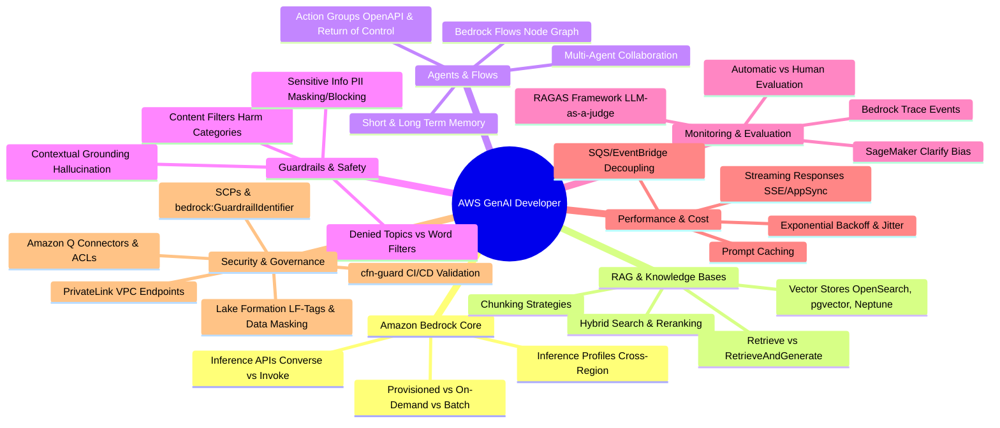
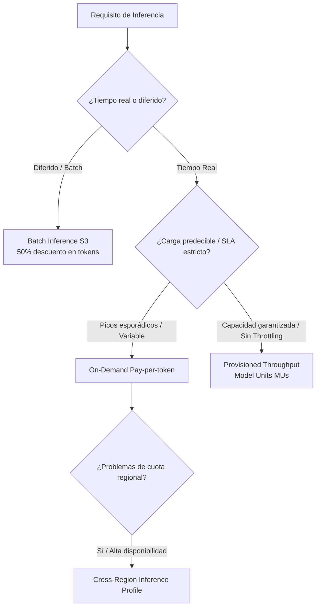
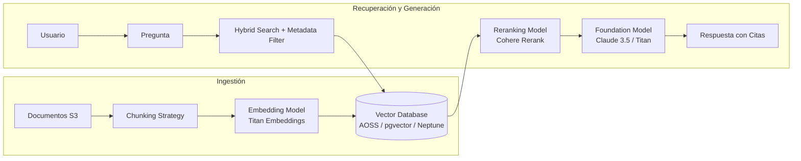
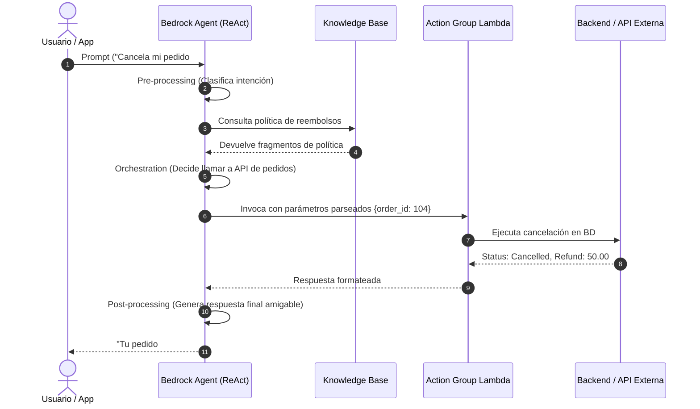
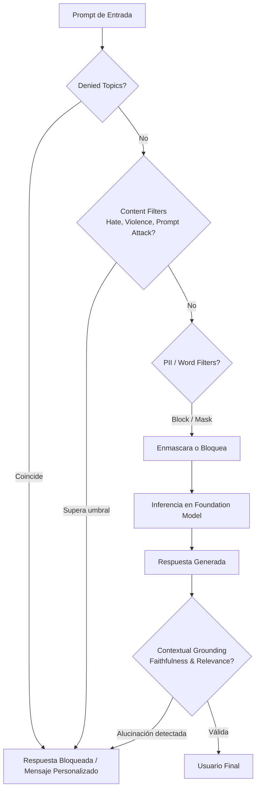
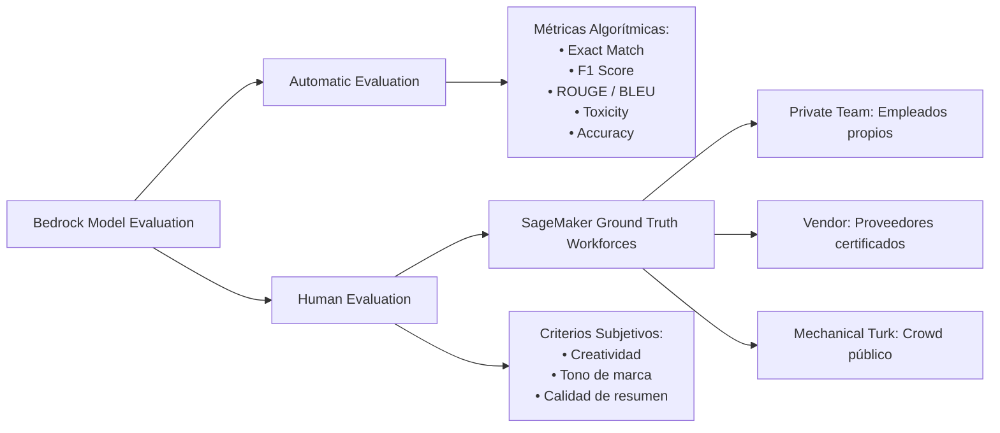
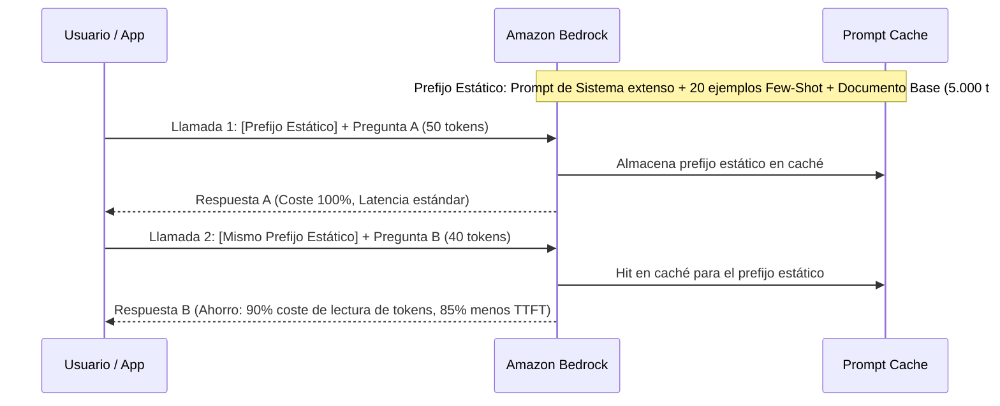
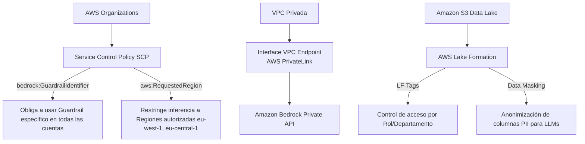

# 📘 LIBRO DE ESTUDIO OFICIAL: AWS CERTIFIED GENERATIVE AI DEVELOPER
> **Guía Conceptual, Patrones de Arquitectura y Reglas de Decisión para el Examen**  
> *Basado en el análisis exhaustivo de 97 escenarios reales de examen (207 páginas)*

---

## 🧭 ÍNDICE GENERAL

1. [Mapa de Competencias y Estrategia de Examen](#1-mapa-de-competencias-y-estrategia-de-examen)
2. [Módulo 1: Amazon Bedrock — Fundamentos y APIs de Inferencia](#módulo-1-amazon-bedrock--fundamentos-y-apis-de-inferencia)
3. [Módulo 2: RAG y Knowledge Bases (Bases de Conocimiento)](#módulo-2-rag-y-knowledge-bases-bases-de-conocimiento)
4. [Módulo 3: Agentes Autónomos y Orquestación (Agents & Flows)](#módulo-3-agentes-autónomos-y-orquestación-agents--flows)
5. [Módulo 4: Guardrails, Seguridad y Filtrado de Contenido](#módulo-4-guardrails-seguridad-y-filtrado-de-contenido)
6. [Módulo 5: Monitorización, Trazabilidad y Evaluación de Modelos](#módulo-5-monitorización-trazabilidad-y-evaluación-de-modelos)
7. [Módulo 6: Rendimiento, Escalabilidad y Optimización de Costes](#módulo-6-rendimiento-escalabilidad-y-optimización-de-costes)
8. [Módulo 7: Seguridad, Gobernanza, Privacidad y Cumplimiento](#módulo-7-seguridad-gobernanza-privacidad-y-cumplimiento)
9. [Módulo 8: Matriz de Decisión Rápida y Cheat Sheet del Examen](#módulo-8-matriz-de-decisión-rápida-y-cheat-sheet-del-examen)

---

## 1. MAPA DE COMPETENCIAS Y ESTRATEGIA DE EXAMEN

El examen evalúa tu capacidad para diseñar, construir, desplegar, optimizar y asegurar aplicaciones de Inteligencia Artificial Generativa sobre AWS.



---

## MÓDULO 1: AMAZON BEDROCK — FUNDAMENTOS Y APIS DE INFERENCIA

Amazon Bedrock es el servicio serverless totalmente gestionado que ofrece acceso a Foundation Models (FMs) líderes de la industria (Anthropic Claude, Meta Llama, Mistral AI, Amazon Titan, Cohere, AI21 Labs) mediante una API unificada.

### 1.1 APIs de Invocación: ¿Cuál elegir?

| API | Caso de Uso Principal | Streaming | Ventajas Clave |
| :--- | :--- | :--- | :--- |
| **`Converse` / `ConverseStream`** | **Recomendada por defecto** para aplicaciones de chat y generación conversacional multivuelta. | Sí (`ConverseStream`) | **Estandariza el formato de mensajes** (system, user, assistant) y tool calling a través de TODOS los proveedores de modelos. Permite cambiar de modelo sin refactorizar el payload JSON. |
| **`InvokeModel` / `InvokeModelWithResponseStream`** | Invocación de bajo nivel para características específicas del proveedor no unificadas. | Sí (`...ResponseStream`) | Requiere formatear el payload JSON específico del proveedor (ej. formato Anthropic vs formato Meta). |
| **`RetrieveAndGenerate`** | Flujos RAG directos integrados con Knowledge Bases. | No | Consulta la base de datos vectorial, inyecta fragmentos y genera la respuesta con citas de origen en una sola llamada. |
| **`Retrieve`** | Flujos RAG desacoplados. | No | Devuelve solo los fragmentos relevantes (`retrievedChunks`) y sus metadatos sin invocar el LLM generador. |

> [!IMPORTANT]
> **Regla de Examen:** Si la pregunta menciona una aplicación multimodelo o migración de un modelo a otro con mínimo esfuerzo de desarrollo, la respuesta correcta siempre involucra la **API Converse / ConverseStream**.

---

### 1.2 Modos de Inferencia y Modelos de Precios



1. **On-Demand (Bajo demanda):** Pago por token procesado (entrada y salida). Sujeto a cuotas de TPS (transacciones por segundo) y concurrencia regional.
2. **Provisioned Throughput (Rendimiento Aprovisionado):**
   - Reserva capacidad de cómputo dedicada mediante **Model Units (MUs)**.
   - Garantiza que **nunca recibirás errores de Throttling (HTTP 429)** por saturación de capacidad compartida.
   - Obligatorio para modelos personalizados (*Custom Models* ajustados con Fine-Tuning).
   - Opciones de compromiso: Sin compromiso (por hora), 1 mes o 6 meses (con descuento progresivo).
3. **Batch Inference (Inferencia por Lotes):**
   - Procesa millones de registros de forma asíncrona leyendo desde un bucket de Amazon S3 y escribiendo los resultados en S3.
   - Ofrece un **50% de descuento en el coste por token** frente a On-Demand.
   - Ideal para resúmenes nocturnos, clasificación masiva de catálogos y extracción de entidades en repositorios históricos.
4. **Cross-Region Inference (Inferencia Multi-Región):**
   - Utiliza **Inference Profiles** (perfiles de inferencia definidos por el sistema o la aplicación).
   - Enruta automáticamente el tráfico entre varias Regiones AWS para maximizar la disponibilidad y evitar cuotas de throttling en horas punta.
   - Respeta los límites geográficos mediante prefijos: `us.` (Estados Unidos), `eu.` (Europa), `apac.` (Asia-Pacífico), garantizando la residencia de datos continental.

---

## MÓDULO 2: RAG Y KNOWLEDGE BASES (BASES DE CONOCIMIENTO)

Retrieval-Augmented Generation (RAG) permite a los LLMs responder preguntas basadas en datos empresariales privados y actualizados sin necesidad de reentrenar el modelo.



### 2.1 Estrategias de Chunking (Fragmentación)

El tamaño y la estrategia de chunking determinan la calidad semántica de la recuperación.

| Estrategia de Chunking | Cómo Funciona | Cuándo Utilizarlo en el Examen |
| :--- | :--- | :--- |
| **Fixed-size (Tamaño Fijo / Default)** | Divide el texto en bloques de N tokens (por defecto 300 tokens, 20% overlap). | Documentos homogéneos estándar, notas breves, artículos sencillos. |
| **Hierarchical (Parent-Child)** | Genera chunks hijos pequeños (ej. 100 tokens) para la **búsqueda de similitud precisa**, pero recupera el chunk padre más grande (ej. 800 tokens) para **inyectarlo como contexto al LLM**. | **Casos donde se necesita contexto amplio para síntesis o resúmenes, pero conservando la precisión de búsqueda en fragmentos específicos.** |
| **Semantic Chunking** | Evalúa la similitud coseno entre oraciones adyacentes; crea un nuevo fragmento cuando el cambio temático supera un umbral. | Documentos extensos con cambios de tema frecuentes (manuales técnicos, transcripciones de reuniones, contratos con múltiples cláusulas). |
| **Custom Chunking (AWS Lambda)** | Invocación de una función Lambda durante la sincronización de la base de conocimiento para aplicar lógica propietaria (ej. respetar tablas complejas, etiquetas HTML específicas o formatos JSON/XML). | Formatos de archivo altamente estructurados o propietarios que las estrategias estándar destruyen. |

---

### 2.2 Bases de Datos Vectoriales Soportadas

1. **Amazon OpenSearch Serverless (AOSS) - Vector Engine:**
   - La opción nativa y preferida por defecto en Bedrock.
   - Colección de búsqueda vectorial serverless; autoescala cómputo (OCUs) y almacenamiento.
2. **Amazon Aurora PostgreSQL / Amazon RDS PostgreSQL con `pgvector`:**
   - Para empresas que ya tienen datos relacionales en PostgreSQL y desean unificar datos transaccionales con vectores semánticos en una única base de datos.
3. **Pinecone / Qdrant / Redis Enterprise:**
   - Bases de datos vectoriales dedicadas de terceros integradas de forma nativa.
4. **Amazon Neptune Analytics (Graph RAG):**
   - Combina **búsqueda vectorial con bases de datos de grafos**.
   - Ideal cuando las entidades tienen relaciones complejas y transitivas (ej. análisis de fraude, redes de suministro, dependencias farmacéuticas o mapas de conocimiento interconectados).

---

### 2.3 Técnicas Avanzadas de Recuperación

- **Hybrid Search (Búsqueda Híbrida):** Combina **búsqueda vectorial densa** (similitud semántica basada en embeddings) con **búsqueda léxica dispersa** (BM25 / coincidencia exacta de palabras clave, códigos de error, números de serie o nombres propios).
- **Metadata Filtering (Filtrado por Metadatos):**
  - Aplica filtros previos o durante la búsqueda vectorial utilizando pares clave-valor asociados al documento (ej. `department == 'HR'`, `year >= 2024`, `confidentiality == 'public'`).
  - Garantiza que los usuarios solo recuperen fragmentos para los que tienen permisos o que correspondan al contexto temporal/organizacional adecuado.
- **Reranking (Reordenamiento Semántico):**
  - Tras recuperar los mejores $k$ fragmentos (ej. top 25) mediante búsqueda rápida, un modelo de reranking (como *Amazon Bedrock Rerank* o *Cohere Rerank*) reordena los fragmentos según su relevancia contextual estricta con la pregunta, pasando solo los mejores 3-5 al LLM. Reduce costes y elimina información irrelevante.

---

## MÓDULO 3: AGENTES AUTÓNOMOS Y ORQUESTACIÓN (AGENTS & FLOWS)

Los **Amazon Bedrock Agents** extienden las capacidades de los LLMs permitiéndoles razonar mediante el patrón **ReAct (Reasoning + Acting)**, consultar Knowledge Bases y ejecutar llamadas a APIs externas.



### 3.1 Anatomía de un Amazon Bedrock Agent

1. **Foundation Model:** El motor de razonamiento (ej. Claude 3.5 Sonnet).
2. **Instruction (Instrucción del Sistema):** Define la personalidad, rol, restricciones y objetivos del agente.
3. **Action Groups (Grupos de Acciones):**
   - Definen las acciones que el agente puede realizar en el mundo real.
   - Se configuran mediante un **esquema OpenAPI (JSON/YAML en S3)** que describe los endpoints, métodos, parámetros requeridos y tipos de datos.
   - **Mecanismos de Ejecución:**
     * **AWS Lambda Function:** Bedrock invoca automáticamente una función Lambda que ejecuta la lógica y devuelve el resultado.
     * **Return of Control (RoC):** Bedrock *no* llama a Lambda; en su lugar, devuelve el control a la aplicación cliente con el nombre de la función y los parámetros estructurados que necesita ejecutar. La aplicación cliente ejecuta la acción en su entorno local/on-premises y devuelve los resultados al agente en la siguiente llamada a la API.
4. **Knowledge Bases asociadas:** Para búsqueda RAG automatizada cuando el usuario hace preguntas informativas.
5. **Memoria y Gestión de Sesiones:**
   - **Sesión a Corto Plazo:** Mantiene el contexto de la conversación actual utilizando un `sessionId` (tiempo de vida configurable, por defecto 1 hora).
   - **Memoria a Largo Plazo:** Resume automáticamente sesiones anteriores del usuario para personalizar interacciones futuras conservando preferencias históricas.

---

### 3.2 Colaboración Multi-Agente y Amazon Bedrock Flows

- **Multi-Agent Collaboration:** Arquitectura jerárquica donde un **Supervisor Agent (Agente Enrutador)** recibe la solicitud del usuario, descompone el problema y delega subtareas a **Subagentes especializados** (ej. Agente de Facturación, Agente de Soporte Técnico, Agente de Reservas).
- **Amazon Bedrock Flows:** Entorno visual para orquestar flujos de trabajo generativos deterministas mediante un grafo de nodos dirigidos:
  - *Prompt nodes:* Invocación de prompts parametrizados.
  - *Knowledge Base nodes:* Consultas RAG.
  - *Condition / Branching nodes:* Lógica condicional basada en reglas.
  - *Lambda nodes:* Transformación de datos y ejecución de código.
  - *Lex / Collector nodes:* Captura de slots e interacción con el usuario.

---

## MÓDULO 4: GUARDRAILS, SEGURIDAD Y FILTRADO DE CONTENIDO

**Amazon Bedrock Guardrails** implementa salvaguardas de seguridad independientes del modelo para filtrar entradas de usuario maliciosas y salidas generadas no deseadas. Se puede aplicar a modelos de Bedrock, agentes, knowledge bases e incluso modelos alojados fuera de AWS.



### 4.1 Componentes de un Guardrail

| Componente | Qué Detecta / Hace | Configuración / Acción |
| :--- | :--- | :--- |
| **Denied Topics (Temas Denegados)** | Bloquea conversaciones sobre temas específicos definidos semánticamente en lenguaje natural (ej. "asesoramiento financiero personalizado", "opiniones políticas", "preguntas sobre la competencia"). | Definición en texto con ejemplos positivos/negativos. Acción: **Block**. |
| **Content Filters (Filtros de Contenido)** | Detecta contenido dañino en 6 categorías: *Hate, Insults, Sexual, Violence, Misconduct, Prompt Attack (Jailbreak / Injection)*. | Severidad configurable por separado para Input y Output: **None, Low, Medium, High**. |
| **Sensitive Information Filters (PII)** | Detecta información de identificación personal (SSN, tarjetas de crédito, emails, teléfonos, etc.) y patrones regex personalizados. | Acciones disponibles: **Block** (bloquea la solicitud) o **Mask** (reemplaza el dato por `[ANONYMIZED]`). |
| **Word Filters & Profanity** | Bloquea palabras exactas, términos ofensivos, marcas de competidores o listas personalizadas desde archivos CSV en S3. | Acción: **Block**. |
| **Contextual Grounding Check** | Evalúa si la respuesta está fundamentada en el contexto de la Knowledge Base y si es relevante a la pregunta del usuario. | **Grounding Score** (Fidelidad / Anti-alucinación) y **Relevance Score** (Pertinencia). Umbrales de 0.0 a 1.0. |

> [!TIP]
> **Diferencia Clave para el Examen:**
> - Para evitar que el modelo invente datos no presentes en los documentos recuperados de una KB $\rightarrow$ **Contextual Grounding con umbral alto de Grounding Score**.
> - Para evitar que hablen de temas fuera de dominio $\rightarrow$ **Denied Topics**.
> - Para ocultar números de tarjetas de crédito sin cancelar la conversación $\rightarrow$ **Sensitive Info Filter con acción MASK**.

---

## MÓDULO 5: MONITORIZACIÓN, TRAZABILIDAD Y EVALUACIÓN DE MODELOS

### 5.1 Model Evaluation en Amazon Bedrock

Amazon Bedrock ofrece dos modalidades de evaluación de modelos para comparar rendimiento entre diferentes FMs o prompts:



---

### 5.2 Framework RAGAS y Evaluación LLM-as-a-Judge

Para evaluar sistemas RAG en producción, se utiliza el framework RAGAS (*Retrieval Augmented Generation Assessment*):

$$\text{Calidad RAG} = f(\text{Context Relevance}, \text{Faithfulness}, \text{Answer Relevance})$$

1. **Context Relevance (Relevancia del Contexto):** Mide si los fragmentos recuperados por la base de datos vectorial son exclusivamente relevantes para la pregunta del usuario (elimina ruido).
2. **Faithfulness / Groundedness (Fidelidad):** Mide si todas las afirmaciones de la respuesta generada pueden deducirse directamente del contexto recuperado (cero alucinaciones).
3. **Answer Relevance (Relevancia de la Respuesta):** Mide si la respuesta generada atiende directamente a la pregunta formulada, sin importar si el contexto era completo.

---

### 5.3 Trazabilidad y Métricas Operacionales

- **Bedrock Trace Events:** Al ejecutar un agente, Bedrock emite eventos de traza detallados divididos en 4 fases:
  1. `PreProcessingTrace`: Análisis y clasificación de la intención del usuario.
  2. `OrchestrationTrace`: Razonamiento paso a paso, selección de herramientas/APIs e invocación de Knowledge Bases.
  3. `PostProcessingTrace`: Formateo de la respuesta final antes de enviarla al usuario.
  4. `FailureTrace`: Diagnóstico de fallos en llamadas a Lambdas o esquemas OpenAPI inválidos.
- **Model Invocation Logging:** Permite registrar los textos completos de prompts, respuestas de modelos, metadatos y embeddings en un bucket de **Amazon S3** o en un grupo de logs de **Amazon CloudWatch Logs** (cifrados con AWS KMS).
- **Métricas CloudWatch de Guardrails:**
  - `InvocationsIntervened`: Conteo de solicitudes bloqueadas o modificadas por el guardrail.
  - Dimensión: `GuardrailContentSource` (`INPUT` o `OUTPUT`).

---

## MÓDULO 6: RENDIMIENTO, ESCALABILIDAD Y OPTIMIZACIÓN DE COSTES

### 6.1 Manejo de Latencia y Streaming

- **Streaming de Respuestas:**
  - Utiliza `ConverseStream` o `InvokeModelWithResponseStream` para transmitir tokens al cliente conforme se generan.
  - Reduce radicalmente el **Time To First Token (TTFT)** percibido por el usuario.
  - Implementaciones en el frontend: AWS AppSync (GraphQL Subscriptions sobre WebSockets), AWS Lambda Function URLs con *Response Streaming*, o Server-Sent Events (SSE).
- **Latency Optimization Parameter:**
  - En la API de Bedrock, configurar el parámetro `performanceConfig: { "latency": "optimized" }` prioriza rutas de inferencia de baja latencia para modelos que lo soportan.

---

### 6.2 Prompt Caching (Caché de Prompts)



- **¿Cómo funciona?** Los modelos de Anthropic Claude en Bedrock permiten cachear prefijos de contexto repetitivos (instrucciones de sistema largas, catálogos de productos, documentos legales fijos).
- **Beneficio:** Reducción de hasta un **90% en el coste de tokens de entrada** y hasta un **85% en la latencia** de respuesta.

---

### 6.3 Resiliencia ante Throttling (Error HTTP 429)

Cuando una aplicación supera las cuotas de tokens o transacciones por segundo (TPS):

1. **Estrategia Inmediata:** Implementar reintentos en el cliente con **Exponential Backoff y Jitter** (evita el problema de *thundering herd*).
2. **Desacoplamiento Asíncrono:** Utilizar una cola de **Amazon SQS** o un bus de eventos de **Amazon EventBridge** frente a las funciones consumidoras para amortiguar y aplanar los picos de tráfico.
3. **Escalado de Capacidad:** Migrar de On-Demand a **Provisioned Throughput (MUs)** o activar **Cross-Region Inference Profiles**.

---

## MÓDULO 7: SEGURIDAD, GOBERNANZA, PRIVACIDAD Y CUMPLIMIENTO

### 7.1 Políticas de Seguridad y Control Centralizado



1. **Forzar Guardrails en Toda la Organización:**
   - En una **Service Control Policy (SCP)** de AWS Organizations, utilizar la clave de condición:
     ```json
     "Condition": {
       "StringNotEquals": {
         "bedrock:GuardrailIdentifier": "arn:aws:bedrock:region:account:guardrail/id"
       }
     }
     ```
   - Bloquea cualquier llamada a `bedrock:InvokeModel` o `bedrock:Converse` que no incluya el Guardrail corporativo aprobado.

2. **Aislamiento de Red con AWS PrivateLink:**
   - Configurar **Interface VPC Endpoints** (`com.amazonaws.region.bedrock-runtime`) en las subredes privadas.
   - El tráfico entre tu VPC y Amazon Bedrock nunca transita por la Internet pública.

3. **Gobernanza de Datos con AWS Lake Formation:**
   - Utiliza **LF-Tags (Lake Formation Tags)** para control de acceso basado en atributos (ABAC).
   - Permite aplicar **seguridad a nivel de fila y columna**, así como **enmascaramiento de datos (Data Masking / Cell-Level Security)** para garantizar que los modelos solo tengan visibilidad de campos desanonimizados según el rol del usuario.

4. **Validación de Infraestructura como Código (IaC):**
   - **AWS CloudFormation Guard (`cfn-guard`):** Herramienta CLI declarativa que valida plantillas de CloudFormation/CDK en la **pipeline de CI/CD ANTES del despliegue**. Evita el aprovisionamiento de recursos de GenAI no conformes (ej. buckets S3 sin cifrado KMS o endpoints públicos).

5. **Amazon Q Business y Amazon Q Developer:**
   - **Amazon Q Business S3 Connector:** El control de acceso a nivel de usuario/grupo se configura centralizadamente mediante un único archivo de control de acceso JSON (`aclConfigurationFilePath`).
   - **Amazon Q Business Data Accessor:** Permite a proveedores de software (ISVs) consultar el índice de Amazon Q Business de sus clientes empresariales mediante la API `SearchRelevantContent` de forma segura y federada.
   - **Amazon Q Developer Customizations:** Las reglas y bibliotecas corporativas aprobadas se configuran a nivel de cuenta/organización en el centro de administración, mientras que las reglas de proyecto se ubican en `.amazonq/rules`.

---

## MÓDULO 8: MATRIZ DE DECISIÓN RÁPIDA Y CHEAT SHEET DEL EXAMEN

### 🎯 Tabla de Decisión Rápida: "¿Qué Servicio / Técnica Elegir?"

| Si el escenario pide... | La Solución Correcta en AWS es... | ❌ Distractor Común (Respuesta Incorrecta) |
| :--- | :--- | :--- |
| Enrutar dinámicamente preguntas entre varios agentes especializados | **Multi-Agent Collaboration con Supervisor Agent** o **Bedrock Flows** | Crear un único megamodelo con un prompt gigante no estructurado |
| Ejecutar llamadas a APIs locales/on-premises sin exponer credenciales a AWS | **Bedrock Agents con Return of Control (RoC)** | Crear funciones Lambda con VPC Peering complejo o almacenar claves privadas en S3 |
| Reducir costes un 50% en procesamiento masivo de datos no interactivo | **Bedrock Batch Inference leyendo/escribiendo en S3** | Provisioned Throughput con sobredimensionamiento de MUs |
| Evitar que el LLM invente datos en un sistema RAG | **Bedrock Guardrails con Contextual Grounding (Grounding Score alto)** | Reducir la temperatura a 0 en el prompt (reduce creatividad pero no garantiza grounding) |
| Cumplir regulaciones de residencia de datos en Europa usando Cross-Region Inference | **Inference Profile con prefijo geográfico `eu.` (ej. `eu.anthropic.claude-3-5...`)** | Cross-Region sin restricción o enrutamiento manual con API Gateway entre regiones |
| Unificar llamadas a modelos de diferentes proveedores con el menor esfuerzo | **Amazon Bedrock `Converse` / `ConverseStream` API** | Escribir adaptadores personalizados con `InvokeModel` para cada proveedor |
| Búsqueda semántica sobre documentos técnicos con códigos de error y números de serie | **Hybrid Search (Vector Search + Búsqueda Léxica BM25)** | Búsqueda puramente vectorial con embeddings estándar |
| Búsqueda RAG sobre entidades con dependencias y relaciones complejas | **Amazon Neptune Analytics (Graph RAG)** | Amazon DynamoDB o Amazon OpenSearch estándar sin grafo |
| Validar plantillas IaC de GenAI antes del despliegue en CI/CD | **AWS CloudFormation Guard (`cfn-guard`)** | AWS Config (es reactivo post-despliegue, no preventivo en CI/CD) |
| Evaluar sesgo y equidad entre grupos demográficos en tiempo real | **Amazon SageMaker Clarify con métricas en CloudWatch** | Amazon CloudWatch Logs Insights con expresiones regulares |
| Configurar permisos de acceso a archivos S3 en Amazon Q Business | **Un único archivo JSON referenciado por `aclConfigurationFilePath`** | Crear archivos `acl.json` independientes dentro de cada subcarpeta |
| Reducir latencia y coste en prompts repetitivos muy extensos | **Prompt Caching de Amazon Bedrock / Anthropic** | Fine-Tuning del modelo (mucho más costoso y complejo) |

---

### ⚠️ Los 10 "Gotchas" y Trampas Frecuentes del Examen

1. **`Retrieve` vs `RetrieveAndGenerate`:** Si la aplicación solo necesita los fragmentos para su propio frontend o pipeline personalizada, usa `Retrieve`. Si quieres que Bedrock invoque automáticamente el modelo y devuelva el texto final con citas, usa `RetrieveAndGenerate`.
2. **Guardrails MASK vs BLOCK:** Si el requisito es que la conversación *continúe* pero sin exponer datos personales (PII), la acción debe ser **MASK**, no **BLOCK**.
3. **Provisioned Throughput no reduce la latencia por sí solo:** Reservar MUs garantiza *capacidad y rendimiento (evita 429)*, pero para optimizar latencia de respuesta se usa streaming, modelos más ligeros o `performanceConfig: { "latency": "optimized" }`.
4. **Lake Formation vs S3 Object Tags:** Para gobernanza unificada, control por columnas y anonimización de PII, se usa **AWS Lake Formation (LF-Tags)** sobre el Glue Data Catalog, NO etiquetas directas en objetos de S3.
5. **Bedrock Trace Events:** Los fallos en la orquestación del agente se auditan en el `OrchestrationTrace` / `FailureTrace`, no en las métricas estándar de CloudWatch.
6. **Automatic vs Human Model Evaluation:** Criterios como *exactitud de clasificación, toxicidad y ROUGE/BLEU* se evalúan con **Automatic Evaluation**. Criterios subjetivos como *estilo, adecuación de marca y tono* requieren **Human Evaluation (SageMaker Ground Truth)**.
7. **Cross-Region Inference Profiles:** No transfieren datos de entrenamiento; solo balancean dinámicamente las solicitudes de inferencia en tiempo de ejecución respetando la zona geográfica configurada.
8. **OpenSearch Serverless Vector Engine:** No requiere gestionar clústeres, nodos ni sharding; escala automáticamente mediante *OpenSearch Compute Units (OCUs)*.
9. **Hierarchical Chunking (Parent-Child):** Siempre es la respuesta cuando la búsqueda debe ser muy precisa en términos específicos pero la respuesta del LLM requiere el contexto amplio de la sección completa.
10. **cfn-guard en CI/CD:** Siempre que el enunciado pida "validación preventiva antes de desplegar recursos en la cuenta", la herramienta adecuada es `cfn-guard`.
