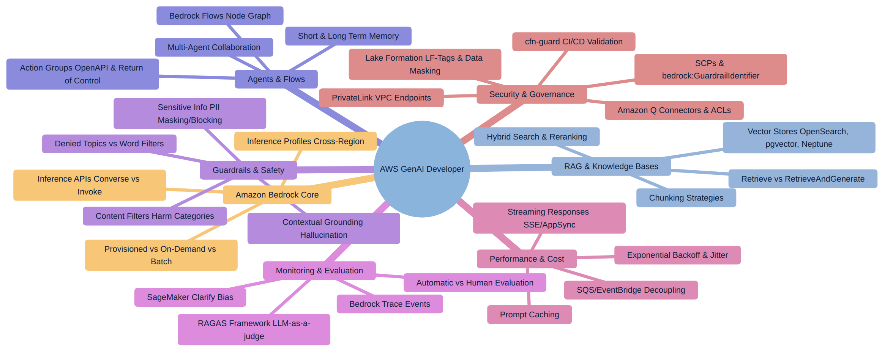

## MÓDULO 0: FUNDAMENTOS DE IA GENERATIVA Y MAPA DE COMPETENCIAS

### ¿Qué es la IA Generativa y qué es un Foundation Model?

La IA Generativa es la rama del *machine learning* dedicada a modelos capaces de **producir contenido nuevo** —texto, código, imágenes, audio— a partir de un contexto de entrada, en lugar de limitarse a clasificar o predecir un valor sobre datos ya existentes. El motor detrás de casi toda aplicación de IA Generativa moderna es el **Foundation Model (FM)**: un modelo de aprendizaje profundo, normalmente basado en la arquitectura *transformer*, entrenado de forma autosupervisada sobre volúmenes masivos de datos (texto de internet, código, libros, imágenes) durante una fase de **preentrenamiento** que cuesta millones de dólares en cómputo. El resultado es un modelo con un conocimiento general amplio del lenguaje, el razonamiento y el mundo, que después puede **adaptarse** a tareas concretas sin tener que repetir ese entrenamiento masivo desde cero.

Esa capacidad de adaptación es exactamente lo que Amazon Bedrock explota, y entenderla como un *espectro* de menor a mayor coste/esfuerzo es la primera idea que hay que interiorizar para el examen, porque una parte enorme de las preguntas gira alrededor de "¿cuál de estas cuatro técnicas es la más barata/rápida/sencilla para lograr X?":

1. **Prompt Engineering** (coste casi nulo, inmediato): se reformula la instrucción, se añaden ejemplos *few-shot* o se estructura mejor el contexto, sin tocar el modelo ni añadir datos externos en tiempo de ejecución. Es siempre la primera palanca a probar y, en el examen, casi nunca es la respuesta "correcta" cuando el escenario exige datos propietarios o actualizados, porque el modelo solo "sabe" lo que aprendió en el preentrenamiento.
2. **RAG (Retrieval-Augmented Generation)** (coste bajo-medio, sin reentrenar): en el momento de la consulta se recuperan fragmentos relevantes de una base de conocimiento propia y se inyectan en el prompt como contexto adicional. El modelo no cambia; lo que cambia es la información que ve. Es la técnica preferida cuando el requisito es "responder con datos actualizados o privados de la empresa" — se cubre en profundidad en el Módulo 2.
3. **Fine-Tuning / Personalización de modelos** (coste alto, requiere datos etiquetados y tiempo de entrenamiento): se ajustan los pesos del modelo con ejemplos propios para especializar su *estilo*, *formato de salida* o *dominio*. En Bedrock, un modelo personalizado (*Custom Model*) exige después **Provisioned Throughput** para poder invocarse (Módulo 1) — un matiz que el examen pregunta explícitamente.
4. **Preentrenamiento desde cero** (coste extremo, prácticamente nunca es la respuesta correcta en un examen orientado a "desarrollador"): reservado a proveedores del modelo, no a equipos de aplicación.

La regla general de examen es: si el enunciado no exige cambiar el comportamiento fundamental del modelo ni su conocimiento factual privado, la solución de menor esfuerzo es prompt engineering; si exige datos propios o actualizados, es RAG; solo si exige cambiar el *comportamiento*, *tono* o *formato* de forma consistente y a gran escala se justifica el fine-tuning.

### Vocabulario que aparece en casi todas las preguntas

Antes de entrar en Bedrock conviene fijar un pequeño vocabulario que el examen usa sin volver a explicar:

- **Token:** unidad mínima de texto que procesa el modelo (aproximadamente ¾ de palabra en inglés). El coste de Bedrock y los límites de las APIs se miden en tokens de entrada y de salida, no en caracteres ni en palabras.
- **Ventana de contexto (*context window*):** número máximo de tokens (entrada + salida) que un modelo puede "ver" en una sola llamada. Es el límite que obliga a diseñar estrategias de *chunking* en RAG y de *prompt caching* en aplicaciones de alto volumen.
- **Embeddings:** representación numérica (un vector de cientos o miles de dimensiones) del significado semántico de un texto. Dos fragmentos con significado similar producen vectores cercanos en ese espacio; esta propiedad es la base matemática de toda búsqueda semántica y, por tanto, de RAG.
- **Parámetros de inferencia — Temperature, Top-P, Top-K:** controlan la aleatoriedad de la generación. *Temperature* alta favorece respuestas más creativas/variadas; baja favorece respuestas deterministas y repetibles. *Top-K* limita el muestreo a los K tokens más probables en cada paso; *Top-P* (*nucleus sampling*) limita el muestreo al conjunto de tokens cuya probabilidad acumulada supera P. El examen suele usar estos parámetros como distractor: bajar la temperatura a 0 reduce la creatividad, pero **no** garantiza que el modelo no alucine ni sustituye a un Guardrail de *Contextual Grounding* (ver Módulo 4).
- **Latencia vs. Throughput:** la latencia es el tiempo hasta obtener una respuesta (o el primer token, *Time To First Token*); el throughput es el volumen de solicitudes o tokens que el sistema puede sostener por unidad de tiempo. Muchas preguntas de rendimiento (Módulo 6) exigen distinguir cuál de los dos es realmente el cuello de botella del escenario antes de elegir la solución.
- **Coste por token vs. coste por hora:** los modelos On-Demand se facturan por token procesado; el Provisioned Throughput se factura por Model Unit y por hora reservada, independientemente del volumen real de tráfico. Confundir ambos modelos de precio es una trampa recurrente.

### Por qué Amazon Bedrock

Antes de Bedrock, construir una aplicación de IA Generativa exigía elegir un proveedor de modelo, gestionar sus SDKs específicos, aprovisionar infraestructura de GPU (propia o de terceros) y resolver por cuenta propia la seguridad, el registro de auditoría y el escalado. Amazon Bedrock es, según la documentación oficial de AWS, *"un servicio completamente gestionado que proporciona acceso seguro y de nivel empresarial a foundation models de alto rendimiento de las principales compañías de IA, permitiendo construir y escalar aplicaciones de IA Generativa"* sin gestionar servidores ni clústeres de entrenamiento (docs.aws.amazon.com/bedrock/latest/userguide/what-is-bedrock.html). Bedrock agrega en una sola superficie de API y de facturación más de un centenar de modelos de proveedores como Amazon (familia Nova), Anthropic (Claude), Meta (Llama), Mistral AI, DeepSeek, Cohere y AI21 Labs, entre otros, y añade sobre ellos las capas transversales que el resto de este libro desarrolla: Knowledge Bases para RAG, Agents y Flows para orquestación, Guardrails para seguridad de contenido, y evaluación/observabilidad integradas con CloudWatch y SageMaker Clarify.

Esa naturaleza "serverless y multi-proveedor" es la clave de una de las reglas de examen más repetidas: cuando un escenario necesita poder **cambiar de modelo o soportar varios proveedores con el mínimo esfuerzo de desarrollo**, la respuesta casi siempre pasa por la capa de abstracción que Bedrock ofrece para eso — típicamente la API `Converse` (Módulo 1) — en lugar de construir integraciones a medida contra el SDK propio de cada proveedor.

<figure class="diagram">

<figcaption>Mapa de competencias evaluadas en el examen</figcaption>
</figure>

### Los siete bloques temáticos del examen

El banco de 97 escenarios reales sobre el que se ha construido este libro se agrupa, de forma casi perfectamente equilibrada, en siete grandes bloques de competencia, que son exactamente los siete módulos que siguen:

1. **Amazon Bedrock Core** (Módulo 1): las APIs de inferencia (`Converse` vs `InvokeModel`), los modos de consumo (On-Demand, Provisioned Throughput, Batch) y la inferencia multi-región.
2. **RAG y Knowledge Bases** (Módulo 2): estrategias de *chunking*, bases de datos vectoriales, búsqueda híbrida y *reranking*.
3. **Agentes y Orquestación** (Módulo 3): el patrón ReAct, *Action Groups*, *Return of Control*, memoria de agente y Bedrock Flows — es, junto con RAG, el bloque con más peso en el examen.
4. **Guardrails y Seguridad de Contenido** (Módulo 4): temas denegados, filtros de contenido, PII y *contextual grounding*.
5. **Monitorización y Evaluación** (Módulo 5): evaluación automática vs. humana, RAGAS, trazas de Bedrock y SageMaker Clarify.
6. **Rendimiento y Coste** (Módulo 6): streaming, *prompt caching*, *throttling* y desacoplamiento asíncrono.
7. **Seguridad y Gobernanza** (Módulo 7): SCPs, PrivateLink, Lake Formation y validación de IaC en CI/CD.

### Cómo están construidas las preguntas y cómo estudiarlas

Casi ninguna pregunta del examen pide una definición aislada ("¿qué es X?"). El formato dominante es el **escenario largo**: una empresa ficticia describe su caso de uso, sus restricciones técnicas y, sobre todo, **un criterio de decisión explícito** —"con el MENOR esfuerzo de desarrollo posible", "sin coste operativo adicional", "cumpliendo con la residencia de datos en la UE", "sin exponer las credenciales corporativas fuera de AWS"— y pide elegir, entre cuatro opciones, la única que satisface *ese* criterio, no solo la que "funcionaría".

Esto tiene una consecuencia práctica para estudiar: **casi todas las opciones incorrectas son técnicamente plausibles**. Suelen ser servicios de AWS reales, usados de forma razonable, que resuelven un problema parecido pero no exactamente el que pide el criterio oculto del enunciado. Por eso cada capítulo de este libro no se limita a explicar "qué hace" cada servicio, sino que dedica secciones explícitas a los **matices que separan a la opción correcta de sus distractores más plausibles** — precisamente el patrón de razonamiento ("por qué A, B y D fallan y por qué C es correcta") que reproducen las explicaciones oficiales del banco de preguntas en el que se basa este libro. Al estudiar, la pregunta que hay que hacerse siempre no es "¿qué servicio de AWS podría resolver esto?" sino "¿qué palabra del enunciado descarta a los otros tres?".

Con esa lente en mente, el Módulo 1 empieza donde toda aplicación de IA Generativa en AWS empieza: las APIs de inferencia de Amazon Bedrock.
