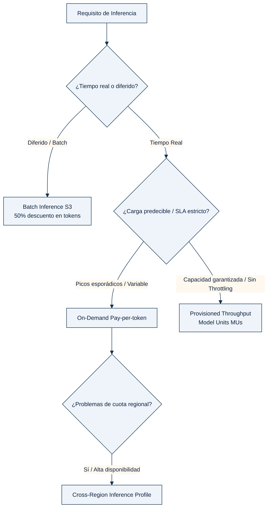

## MÓDULO 1: AMAZON BEDROCK — FUNDAMENTOS Y APIS DE INFERENCIA

### 1.1 Qué es Amazon Bedrock

Amazon Bedrock es el servicio de AWS que expone, mediante una única API administrada y sin servidor (serverless), el acceso a un catálogo de Foundation Models (FMs) de distintos proveedores: Anthropic (familia Claude), Meta (Llama), Mistral AI, Amazon (familia Nova y el histórico Titan), Cohere, AI21 Labs, DeepSeek, OpenAI (mediante los modelos gpt-oss y una API de compatibilidad OpenAI), entre otros. La palabra clave que el examen espera que el candidato entienda en profundidad es "serverless": Bedrock no obliga a aprovisionar, parchear ni escalar manualmente instancias de cómputo (GPU o de otro tipo) para poder invocar un modelo. AWS gestiona la infraestructura subyacente, y el desarrollador solo se preocupa por el contrato de la API —peticiones y respuestas HTTP/JSON firmadas con SigV4 e IAM— y por el modo de facturación que elige (on-demand, aprovisionado o por lotes, como se detalla más adelante).

Esta arquitectura tiene dos consecuencias directas que aparecen constantemente en las preguntas de examen. La primera es que el control de acceso a cada modelo se gestiona con políticas de IAM sobre acciones como `bedrock:InvokeModel`, `bedrock:InvokeModelWithResponseStream`, `bedrock:Converse` o `bedrock:ConverseStream`, en lugar de credenciales de aplicación separadas por proveedor de modelo: da igual si el modelo detrás es Claude o Nova, la autenticación siempre pasa por el mismo mecanismo de roles de IAM del propio servicio Bedrock. La segunda es que, al no existir instancias dedicadas al modelo por defecto, Bedrock necesita ofrecer varios "modos de inferencia" —on-demand, aprovisionado y por lotes— para cubrir perfiles de carga muy distintos, y el examen evalúa sistemáticamente si el candidato sabe emparejar cada escenario de negocio con el modo correcto.

Por encima de esos modos de inferencia, Bedrock añade una capa de API unificada (`Converse`/`ConverseStream`) que resuelve un problema práctico real: cada proveedor de modelos definió originalmente su propio formato de petición y de respuesta JSON, lo que complicaba escribir código portable entre modelos. Entender por qué existe esa capa —y cuándo conviene evitarla— es el segundo bloque teórico de este módulo.

### 1.2 Converse/ConverseStream frente a InvokeModel/InvokeModelWithResponseStream

Bedrock ofrece dos familias de operaciones de inferencia, ambas expuestas únicamente en el endpoint de plano de datos `bedrock-runtime` (no en el plano de control `bedrock`, que se usa para tareas administrativas como crear Provisioned Throughput o gestionar modelos personalizados).

`InvokeModel` e `InvokeModelWithResponseStream` son las operaciones de bajo nivel, prácticamente un paso directo hacia el modelo subyacente: el cuerpo de la petición (`body`) es un JSON cuya estructura depende por completo del proveedor del modelo. Invocar un modelo de Anthropic requiere un esquema de mensajes con campos como `anthropic_version`, `max_tokens` y un array `messages`; invocar un modelo de la familia Titan de Amazon requiere un esquema distinto con `inputText` y `textGenerationConfig`. Esto significa que cualquier aplicación que quiera admitir varios modelos, o migrar de un modelo a otro, debe mantener lógica de serialización/deserialización distinta para cada proveedor. La ventaja de esta familia de operaciones es el acceso íntegro a todos los parámetros específicos de cada modelo, incluidos los más nuevos o menos habituales que todavía no se hayan mapeado al formato común.

`Converse` y `ConverseStream` (esta última siendo la variante con streaming de tokens en tiempo real) nacen precisamente para eliminar esa fricción. Definen un esquema de solicitud y de respuesta idéntico para todos los modelos de Bedrock que admiten conversación: un array `messages` donde cada mensaje tiene un `role` (`user` o `assistant`, nunca `system` dentro del array: las instrucciones de sistema se pasan aparte, en un campo `system` de nivel superior de la petición), un bloque `content` que puede combinar texto, imágenes o documentos, un objeto `inferenceConfig` para parámetros comunes como `maxTokens`, `temperature` o `topP`, y —crucialmente— un mecanismo estandarizado de tool use / function calling mediante los campos `toolConfig` (para declarar las herramientas disponibles con su esquema JSON de entrada) y `toolUse`/`toolResult` (para que el modelo solicite invocar una herramienta y la aplicación le devuelva el resultado en el turno siguiente). Gracias a esa estandarización, el mismo código de orquestación de un agente puede intercambiar Claude por Nova o por Llama sin reescribir la capa de parseo, siempre que el caso de uso no dependa de un parámetro exclusivo de un proveedor concreto; y si lo necesita, `Converse` permite igualmente inyectar parámetros adicionales específicos del modelo a través de `additionalModelRequestFields`, sin perder la compatibilidad del resto del esquema.

El razonamiento que el examen premia no es memorizar "usa Converse por defecto", sino entender el porqué: cuando el enunciado describe una aplicación que debe (a) funcionar igual en varios lenguajes de programación o SDKs, (b) sobrevivir a un cambio o a una comparación entre FMs, o (c) mantener contexto conversacional multi-turno de forma sencilla —reenviando el propio array de `messages` con los turnos anteriores, sin infraestructura de estado dedicada—, la respuesta correcta casi siempre pasa por `Converse`/`ConverseStream`. Por el contrario, cuando el enunciado exige un parámetro de inferencia exclusivo de un proveedor que aún no está expuesto en el esquema común, o cuando ya existe una integración heredada fuertemente acoplada al formato nativo de un modelo concreto, `InvokeModel`/`InvokeModelWithResponseStream` sigue siendo la elección correcta. Ambas familias comparten el mismo modelo de autenticación por IAM y ambas pueden apuntar tanto a un modelo base on-demand como a un ARN de Provisioned Throughput o a un perfil de inferencia entre regiones como `modelId`, así que la elección entre una y otra depende del formato de payload que necesita la aplicación, no del modo de facturación o de capacidad que se esté usando por debajo.

Conviene distinguir también estas dos operaciones de los dos métodos de invocación orientados a RAG con Knowledge Bases: `RetrieveAndGenerate`, que en una sola llamada consulta la base de conocimiento vectorial y genera la respuesta final con citas a las fuentes recuperadas, y `Retrieve`, que solo devuelve los fragmentos relevantes sin invocar ningún FM, dejando la generación en manos de la aplicación (típicamente porque esta necesita combinar esos fragmentos con su propia lógica de prompting, orquestación de agentes o post-procesado antes de generar la respuesta).

### 1.3 Modos de inferencia en profundidad

**On-Demand.** Es el modo de facturación por defecto: se paga por token de entrada y de salida consumido, sin ningún compromiso de capacidad ni de tiempo. La contrapartida es que la capacidad on-demand es compartida entre todos los clientes de una región y está sujeta a cuotas de solicitudes por minuto (RPM) y tokens por minuto (TPM) específicas de cada modelo; superarlas produce respuestas de throttling (error `ThrottlingException`) que la aplicación debe absorber, típicamente con reintentos con backoff exponencial. La documentación reciente de Bedrock matiza este modo distinguiendo niveles de servicio dentro del propio on-demand —Flex (el más económico, orientado a cargas tolerantes a demoras y con mayor riesgo de throttling, sin SLA), Standard (el equilibrio habitual de producción) y Priority (mayor coste por token a cambio de una asignación de throughput preferente y menor riesgo de throttling)— pero en cualquiera de sus variantes sigue siendo capacidad compartida y elástica, nunca capacidad reservada en exclusiva para la cuenta.

**Provisioned Throughput.** Resuelve exactamente el problema que el on-demand no puede garantizar: capacidad de inferencia dedicada y predecible, medida en Model Units (MUs). Cada MU representa una cantidad fija de capacidad de procesamiento (tokens de entrada y de salida por unidad de tiempo) que depende del modelo concreto; al comprar Provisioned Throughput se especifica el número de MUs necesarias y, opcionalmente, un `commitmentDuration`. Según la API `CreateProvisionedModelThroughput`, ese campo acepta únicamente los valores `OneMonth` o `SixMonths`; si se omite, se obtiene una Provisioned Throughput sin compromiso, facturada por hora y cancelable en cualquier momento, aunque a un coste por MU-hora superior al de los compromisos más largos (la duración más larga se paga con un descuento por hora a cambio de una permanencia mínima). Un matiz que el examen explota deliberadamente es que comprar Provisioned Throughput no basta por sí solo: hay que dirigir explícitamente las llamadas de inferencia (`InvokeModel`, `InvokeModelWithResponseStream`, `Converse` o `ConverseStream`) al ARN del modelo aprovisionado —el campo `provisionedModelArn` que devuelve `CreateProvisionedModelThroughput`— en el parámetro `modelId` de la petición; si el código sigue usando el identificador del modelo base on-demand, todo el tráfico continúa yendo a la capacidad compartida, la capacidad reservada aparece como no utilizada en las métricas de CloudWatch, y el throttling en el tráfico on-demand no desaparece, por mucho que se incrementen las MUs compradas. Otro matiz igualmente importante: Provisioned Throughput garantiza capacidad y ausencia de throttling dentro del volumen contratado, pero no es, por sí misma, una técnica de reducción de latencia por solicitud; para eso existe una capacidad distinta, Latency Optimized Inference, que se activa fijando el parámetro `latency` a `optimized` dentro de `performanceConfig` en la propia solicitud de inferencia, sin necesidad de reservar ni pagar capacidad fija, y con la particularidad de que si se agota la cuota de aceleración la petición simplemente se procesa a la latencia estándar en lugar de fallar. Por último, Provisioned Throughput es obligatorio —no opcional— para poder invocar cualquier modelo personalizado (fine-tuned o de continued pre-training) en producción, como se explica en la sección siguiente.

**Batch Inference.** Es el modo pensado para procesar grandes volúmenes de datos sin restricciones de latencia por solicitud individual: se define un trabajo que lee las peticiones desde un bucket de Amazon S3 (en un formato JSONL con un registro por línea) y escribe los resultados en otro bucket o prefijo de S3, procesándolos todos de forma asíncrona. Según la documentación oficial de capacidad y optimización de costes de Bedrock, este modo ofrece un ahorro de aproximadamente el 50% frente al precio on-demand por token, dentro de una ventana de procesamiento de hasta 24 horas y con límites de tamaño de trabajo (hasta 10.000 registros y un archivo de entrada de hasta 200 MB por trabajo, cifras que pueden variar por región y modelo). Es la opción correcta siempre que el enunciado describa generación de datos de entrenamiento, backlogs de moderación de contenido, generación masiva de informes o enriquecimiento de datos: cualquier caso donde no exista un usuario esperando la respuesta en tiempo real.

**Cross-Region Inference (perfiles de inferencia).** No es un modo de facturación distinto —de hecho sigue tarificándose a precio on-demand, sin coste adicional de enrutamiento ni de transferencia de datos— sino un mecanismo de enrutamiento de solicitudes de inferencia. Un perfil de inferencia con prefijo geográfico (`us.`, `eu.`, `apac.`, entre otros) permite que Bedrock distribuya automáticamente las solicitudes entre varias regiones AWS de destino dentro de esa misma área geográfica, aumentando la capacidad efectiva disponible y mejorando la resiliencia frente a picos de tráfico o interrupciones puntuales de una región, sin que el desarrollador tenga que implementar lógica de reintento o failover entre regiones. Es fundamental no confundir esto con el movimiento de datos de entrenamiento: cross-Region inference nunca traslada los pesos del modelo ni afecta a cómo se entrenó; únicamente puede mover, de forma cifrada, el contenido de la solicitud de inferencia (el prompt de entrada y la respuesta generada) hacia otra región de la misma área geográfica para procesarla, y por defecto los datos permanecen almacenados solo en la región de origen. Por esta razón, en escenarios de residencia de datos estrictos por país (no solo por continente), un perfil geográfico "eu." puede no ser suficiente si el requisito exige permanecer en una única región concreta, y conviene revisar qué regiones de destino incluye cada perfil antes de asumir que cumple un requisito de soberanía de datos. Cross-Region Inference sí es compatible con Provisioned Throughput, aunque puede requerir permisos de IAM adicionales sobre el modelo fundacional en todas las regiones de origen y de destino del perfil, no solo en la región donde se invoca.

### 1.4 Personalización de modelos: fine-tuning y continued pre-training

Bedrock permite personalizar un subconjunto de FMs mediante dos técnicas de model customization: el fine-tuning (ajuste fino supervisado con pares de entrada/salida etiquetados, típicamente para especializar el estilo de respuesta o el formato de salida a un dominio concreto) y el continued pre-training (entrenamiento adicional no supervisado sobre un corpus de texto propio del dominio, para que el modelo absorba vocabulario y conocimiento específico sin depender de etiquetas). En ambos casos, el proceso de entrenamiento se ejecuta como un trabajo asíncrono que lee los datos de entrenamiento desde Amazon S3 y produce un "modelo personalizado" (custom model) que queda registrado dentro de la cuenta de Bedrock, asociado siempre al modelo base del que deriva.

La razón teórica —no solo la regla memorística— por la que estos modelos personalizados exigen Provisioned Throughput para poder invocarlos es que un modelo con pesos ajustados deja de ser parte del pool de capacidad compartida on-demand que Bedrock gestiona de forma multiinquilino para los modelos base: sus pesos, distintos a los del modelo base estándar, necesitan una copia de inferencia dedicada dentro de la infraestructura de Bedrock para poder servirse, y esa copia dedicada es exactamente lo que se paga al comprar Model Units. Por eso, aunque para probar un modelo personalizado durante la fase de evaluación se puede usar Provisioned Throughput sin compromiso, cualquier uso sostenido en producción implica necesariamente ese coste de capacidad dedicada, algo que conviene modelar en el análisis de costes desde el diseño del proyecto y no como un descubrimiento tardío tras el entrenamiento.

<figure class="diagram">

<figcaption>Árbol de decisión: cómo elegir el modo de inferencia adecuado</figcaption>
</figure>

Caso de Estudio

Una empresa que procesa informes financieros necesita ejecutar el mismo flujo de análisis en dos entornos muy distintos: funciones Lambda en Python que atienden peticiones puntuales, y contenedores en Amazon EKS que procesan lotes de informes en JavaScript según una programación. El reto no es solo técnico sino de coherencia: el mismo modelo fundacional debe responder igual en ambos entornos, la autenticación debe ser uniforme y el contexto de una conversación multi-turno debe conservarse entre llamadas sucesivas. La tentación de usar `InvokeModel` directamente falla porque obliga a mantener lógica de formateo de payload distinta para cada SDK y complica tener una autenticación consistente entre Lambda y EKS. Añadir una base de datos externa (por ejemplo Amazon ElastiCache) para guardar el estado de la conversación tampoco es necesario: la propia Converse API ya expone un esquema de solicitud/respuesta idéntico en todos los SDK de AWS, así que basta con reenviar el array `messages` completo —incluyendo los turnos anteriores con sus roles `user`/`assistant`— en cada nueva llamada para mantener el contexto, y usar roles de IAM con permiso sobre `bedrock:InvokeModel` como mecanismo de autenticación común a ambos entornos. La lección de fondo es que la Converse API no solo simplifica el código: elimina por diseño la necesidad de infraestructura de estado dedicada para casos de multi-turno sencillos, porque el propio protocolo de mensajes ya es el estado.

Caso de Estudio

Un asistente de atención al cliente de una tienda online recibe un volumen de consultas donde la mayoría son preguntas sencillas sobre productos y una minoría son consultas complejas sobre política de devoluciones que exigen razonamiento más profundo. El objetivo de negocio es enrutar cada consulta al modelo más adecuado sin construir una arquitectura de clasificación propia. Construir un clasificador con un FM adicional y funciones Lambda para dirigir el tráfico funciona, pero implica diseñar, probar y mantener una arquitectura multietapa completa. Crear endpoints separados con reglas basadas en palabras clave tiene el mismo problema, y añadir Provisioned Throughput para el modelo grande suma además un compromiso de capacidad que puede no estar justificado. La solución de mínimo esfuerzo es el intelligent prompt routing nativo de Bedrock: un único endpoint sin servidor que predice, para cada solicitud entrante, qué modelo de una misma familia ofrecerá el mejor equilibrio entre calidad de respuesta y coste, y dirige automáticamente el tráfico sencillo hacia un modelo pequeño y económico y el tráfico complejo hacia un modelo más grande y capaz, ya sea usando un router predeterminado de AWS o configurando uno propio. La idea clave es que "mínimo esfuerzo de implementación" en el enunciado de un examen suele ser la pista textual que apunta hacia una capacidad gestionada de la plataforma, no hacia una arquitectura de orquestación construida a medida, aunque esa arquitectura a medida sea perfectamente viable técnicamente.

Caso de Estudio

Una compañía de servicios financieros compra Provisioned Throughput para sostener un volumen constante de solicitudes durante el horario laboral, pero observa en CloudWatch que la capacidad reservada permanece sin usar mientras las solicitudes on-demand siguen sufriendo throttling en las horas de máxima carga. La causa no está en la cantidad de Model Units contratadas ni se soluciona añadiendo lógica de reintento con backoff: el código de la aplicación sigue invocando el modelo mediante su identificador de modelo base on-demand, de modo que ninguna solicitud llega nunca a la capacidad dedicada, sin importar cuánto se incremente. La corrección consiste en sustituir ese identificador por el ARN del modelo aprovisionado que devuelve la operación `CreateProvisionedModelThroughput` en el parámetro `modelId` de la llamada de inferencia. Este caso ilustra un patrón recurrente en el examen: cuando un enunciado describe capacidad reservada infrautilizada junto con throttling simultáneo en producción, casi siempre la causa raíz es un error de enrutamiento en el parámetro `modelId`, no una insuficiencia real de capacidad ni un problema de resiliencia de la aplicación.

### Fuentes

- https://docs.aws.amazon.com/bedrock/latest/userguide/conversation-inference.html
- https://docs.aws.amazon.com/bedrock/latest/userguide/prompt-routing.html
- https://docs.aws.amazon.com/bedrock/latest/userguide/prov-thru-use.html
- https://docs.aws.amazon.com/bedrock/latest/userguide/prov-throughput.html
- https://docs.aws.amazon.com/bedrock/latest/userguide/prov-thru-purchase.html
- https://docs.aws.amazon.com/bedrock/latest/userguide/prov-thru-prereq.html
- https://docs.aws.amazon.com/bedrock/latest/userguide/custom-model-use-pt.html
- https://docs.aws.amazon.com/bedrock/latest/APIReference/API_CreateProvisionedModelThroughput.html
- https://docs.aws.amazon.com/bedrock/latest/userguide/capacity-limits-cost-optimization.html
- https://docs.aws.amazon.com/bedrock/latest/userguide/latency-optimized-inference.html
- https://docs.aws.amazon.com/bedrock/latest/userguide/geographic-cross-region-inference.html
