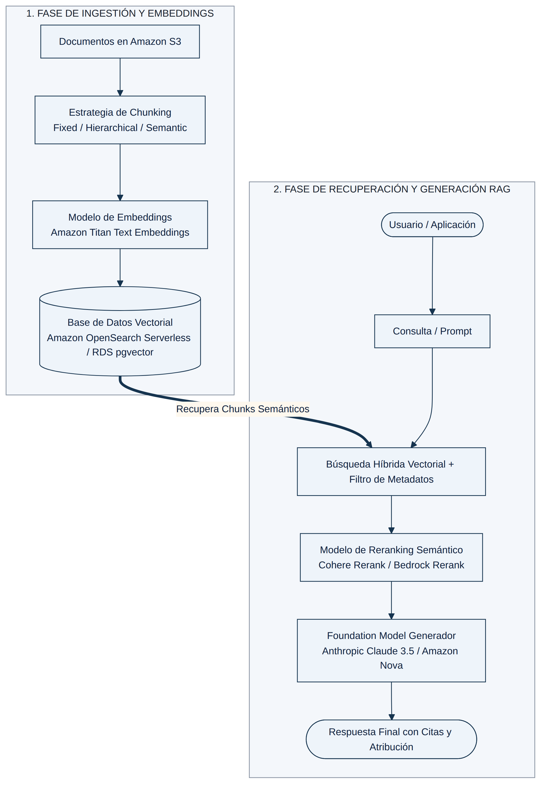

## MÓDULO 2: RAG Y KNOWLEDGE BASES (BASES DE CONOCIMIENTO)

Retrieval-Augmented Generation (RAG) es, con 20 de las 97 preguntas del banco de práctica, el tema individual más examinado — empatado con Agentes. La razón es estructural: casi cualquier aplicación empresarial de IA Generativa necesita anclar sus respuestas en datos propios y actualizados sin reentrenar el modelo, y Amazon Bedrock Knowledge Bases ofrece tantas piezas configurables (almacén vectorial, estrategia de *chunking*, filtrado, *reranking*, descomposición de consultas, ingesta) que el examen puede construir un escenario distinto combinando cada vez una pieza diferente. Dominar este módulo significa entender **qué resuelve cada pieza y cuál es su límite exacto**, porque casi todos los distractores son técnicamente plausibles — simplemente no resuelven el requisito específico que pide el enunciado, o lo resuelven con más esfuerzo del necesario.

<figure class="diagram">

<figcaption>Flujo completo de un sistema RAG en Amazon Bedrock: ingestión (chunking + embeddings + almacén vectorial) y recuperación/generación (búsqueda híbrida + reranking + FM).</figcaption>
</figure>

### 2.1 Qué resuelve Bedrock Knowledge Bases y qué no

Una Knowledge Base de Amazon Bedrock es el servicio totalmente gestionado que encapsula las cuatro etapas de un pipeline RAG — trocear documentos, generar embeddings, indexarlos en un almacén vectorial y orquestar la recuperación más la generación — sin que el equipo tenga que escribir ni mantener esa lógica. El patrón recurrente del examen es exactamente ese: cuando una opción propone "construir" alguna de esas etapas a mano (una función Lambda que llama a un modelo de embeddings, un endpoint de SageMaker para reranking, un pipeline con Step Functions), casi siempre es un distractor frente a la opción que activa la capacidad equivalente **ya integrada** en Knowledge Bases — salvo que el enunciado pida explícitamente algo que Knowledge Bases no soporta de forma nativa (una arquitectura de grafo complejísima, un modelo de embeddings de dominio muy específico entrenado a medida, etc.).

### 2.2 Elegir el almacén vectorial correcto

La pregunta "¿qué base de datos vectorial uso?" nunca se responde en abstracto: depende del volumen de datos, de si ya existe una base de datos relacional en la organización, de si se necesita precisión exacta o aproximada, y de si las relaciones entre entidades son tan importantes como la similitud semántica.

- **Amazon OpenSearch Serverless (Vector Engine)** es la opción por defecto y la más recurrente en el examen para colecciones grandes (millones de documentos): es *serverless* (AWS gestiona el aprovisionamiento y el escalado mediante OpenSearch Compute Units, OCU), soporta **filtrado nativo por metadatos** dentro de la propia consulta vectorial, y soporta **búsqueda híbrida** (ver 2.4). Es la respuesta esperada cuando el enunciado combina "millones de embeddings", "múltiples idiomas" y "mínimo esfuerzo de gestión".
- **Amazon Aurora PostgreSQL / RDS PostgreSQL con `pgvector`** (incluida la variante **Aurora Serverless v2**) es la elección natural cuando la empresa ya tiene datos relacionales en PostgreSQL y quiere unificar datos transaccionales con vectores semánticos en el mismo motor, o cuando el volumen es modesto (por debajo de ~1 millón de documentos) y se prioriza la simplicidad operativa de una base serverless sobre un motor de búsqueda dedicado. El matiz de examen: si la variante es la instancia **no-serverless** de Aurora/RDS, la opción pierde puntos frente a una alternativa serverless porque exige aprovisionar y dimensionar manualmente la instancia — justo lo que "mínimo esfuerzo operativo" penaliza.
- **Amazon Neptune Analytics (GraphRAG)** es la respuesta cuando el enunciado describe **relaciones multi-hop** entre entidades — dependencias indirectas entre vehículos de inversión, cadenas de suministro, redes de fraude — y pide "capturar relaciones indirectas" o "conectar información a través de varios pasos lógicos". GraphRAG, integrado de forma nativa en Bedrock Knowledge Bases, automatiza tres pasos: búsqueda vectorial inicial para localizar los nodos relevantes, recuperación de los nodos/chunks conectados a ellos, y expansión del contexto recorriendo el grafo — todo sin que el equipo programe ninguna lógica de recorrido. Si el escenario es una búsqueda semántica simple sin relaciones entre entidades, Neptune Analytics es sobreingeniería: la respuesta correcta suele ser un almacén vectorial convencional.
- **Amazon MemoryDB (Valkey)** aparece cuando el requisito es **maximizar la precisión** sobre un dataset **pequeño** (bajo recuento de índice): el algoritmo **Flat** (búsqueda por fuerza bruta, k-NN exacto) es la respuesta correcta en ese caso concreto, porque el coste de un recorrido lineal es aceptable a pequeña escala y se obtiene precisión exacta con latencia mínima gracias a que MemoryDB es en memoria. El algoritmo **HNSW** (aproximado) es preferible a mayor escala, pero sacrifica algo de precisión — si el enunciado pide explícitamente "maximizar precisión" sobre un índice pequeño, HNSW es el distractor, no la respuesta.
- **Amazon DocumentDB** y **Aurora PostgreSQL con IVFFlat** son también motores de búsqueda **aproximada** (ANN): IVFFlat particiona el espacio vectorial en listas y compara solo un subconjunto, lo que introduce pérdida de recall frente a un método exacto como Flat.
- **Amazon S3 Vectors** es una opción relativamente nueva con dos tipos de metadatos: **filterable** (el comportamiento por defecto, permite filtrar en la consulta de similitud) y **non-filterable** (se devuelven junto al resultado pero **no** se pueden usar como filtro, y esa marca es irreversible). Si un escenario exige filtrar por fecha, agencia o tipo de documento y la opción configura esos campos como *non-filterable*, esa opción es incorrecta aunque S3 Vectors en sí sea una integración válida con Knowledge Bases.
- **Terceros integrados de forma nativa**: Pinecone, Qdrant y Redis Enterprise también son almacenes vectoriales soportados cuando la organización ya opera con ellos.

### 2.3 Estrategias de chunking y un matiz que el examen explota

El tamaño y la estrategia de *chunking* determinan directamente la calidad semántica de la recuperación, y el examen prueba tanto el **cuándo usar cada estrategia** como una restricción operativa poco intuitiva.

| Estrategia | Cómo funciona | Cuándo es la respuesta correcta |
| :--- | :--- | :--- |
| **Fixed-size (por defecto)** | Bloques de N tokens (300 por defecto, ~20% de overlap). | Documentos homogéneos y sencillos. Es el distractor típico cuando el problema real es que corta argumentos o cláusulas a la mitad. |
| **Hierarchical (Parent-Child)** | Chunks hijo pequeños para precisión de búsqueda; se recupera el chunk padre completo como contexto. | Cuando se necesita contexto amplio para síntesis, pero el escenario no exige agrupar por *significado* — solo por tamaño en dos niveles. |
| **Semantic** | Divide por similitud coseno entre oraciones adyacentes; parámetros `breakpointPercentileThreshold` y `bufferSize`. | La respuesta preferida cuando el problema descrito es "se pierde contexto clave" o "se citan datos desactualizados/incompletos" porque el chunking de tamaño fijo corta argumentos legales, cláusulas o secciones a la mitad. Prioriza el significado sobre la posición del texto. |
| **Custom (AWS Lambda)** | Lógica propietaria invocada durante la sincronización. | Formatos altamente estructurados (tablas complejas, XML/JSON propietario) que las estrategias estándar destruyen. |

⚠ Regla de Examen

La estrategia de chunking de una Knowledge Base <strong>no se puede modificar después de conectar la fuente de datos</strong>. Si un escenario pide corregir un problema de fragmentación semántica, la solución correcta casi siempre implica <strong>reconfigurar la ingesta desde cero y regenerar los embeddings</strong> con la nueva estrategia — no un ajuste en caliente. Aumentar la dimensionalidad del embedding o migrar el almacén vectorial sin tocar el chunking nunca corrige un problema de fragmentación: la causa raíz sigue intacta.

### 2.4 Metadata filtering, búsqueda híbrida y reranking: tres capas de precisión distintas

Estas tres técnicas se confunden fácilmente porque todas "mejoran la relevancia", pero atacan problemas diferentes y el examen exige identificar cuál corresponde a cada síntoma:

- **Metadata filtering** reduce el *universo* de documentos sobre los que se calcula similitud, **antes** de la búsqueda vectorial. Con una fuente de datos en S3, se implementa adjuntando a cada objeto un archivo complementario `nombre-archivo.metadata.json` con atributos (tipo de contenido, fecha, autor); una vez indexados, se filtra por esos atributos en `Retrieve`/`RetrieveAndGenerate`. Es la respuesta correcta cuando el síntoma es "la búsqueda vectorial evalúa demasiados documentos irrelevantes de tipos o periodos distintos" y el requisito es un cambio mínimo sobre la arquitectura existente — no exige migrar de almacén vectorial ni reentrenar embeddings.
- **Hybrid search** combina, dentro de una misma consulta, la puntuación léxica (BM25, exacta) con la puntuación semántica (vectorial/k-NN), normalizando y combinando ambas (por ejemplo con `min_max`/`l2` y media aritmética, geométrica o armónica). Es la respuesta correcta cuando el síntoma es que la búsqueda **pierde coincidencias exactas** de términos, acrónimos, códigos de error o citas legales — algo que la búsqueda puramente vectorial "diluye" semánticamente. Se activa como un *search pipeline* sobre el mismo dominio de OpenSearch ya existente, sin infraestructura nueva.
- **Reranking** actúa **después** de la recuperación inicial: sobre los primeros *k* resultados (por ejemplo, 25), un modelo de reranking dedicado (Amazon Rerank o Cohere Rerank) reordena por relevancia contextual estricta y se pasan solo los 3-5 mejores al FM. La forma de menor esfuerzo operativo es habilitarlo **directamente en la configuración de la Knowledge Base** (`rerankingConfiguration` dentro de `vectorSearchConfiguration`, disponible en `Retrieve`/`RetrieveAndGenerate`/`RetrieveAndGenerateStream`) — llamar a la **API `Rerank`** por separado como un paso adicional también funciona, pero obliga a orquestar manualmente varios pasos (Retrieve → Rerank → InvokeModel) en lugar de una sola configuración integrada.

Caso de Estudio — Tres síntomas, tres soluciones distintas

Tres escenarios aparentemente parecidos requieren tres respuestas distintas: (1) si el síntoma es que la búsqueda evalúa demasiados documentos de tipos y periodos irrelevantes y se pide un cambio mínimo, la respuesta es <strong>habilitar filtrado por metadatos</strong> indexando los atributos S3; (2) si el síntoma es que se pierden coincidencias exactas de acrónimos o términos técnicos, la respuesta es <strong>búsqueda híbrida</strong>; (3) si el síntoma es que la recuperación inicial devuelve documentos semánticamente parecidos pero contextualmente irrelevantes y se pide el mínimo esfuerzo operativo, la respuesta es <strong>activar el reranking nativo dentro de la configuración de la Knowledge Base</strong>, no desplegar un modelo de ranking en SageMaker ni orquestar la API Rerank por separado.

### 2.5 Query Decomposition: cuando la pregunta del usuario es el problema

Además de mejorar cómo se buscan los documentos, Bedrock Knowledge Bases puede transformar la propia consulta antes de recuperar: la transformación **`QUERY_DECOMPOSITION`** (configurable vía `QueryTransformationConfiguration`) divide automáticamente una pregunta compleja en subconsultas más simples, cada una enfocada en un concepto o término específico, antes de ejecutar la recuperación. Esto reduce la **dilución semántica** — el efecto por el que una pregunta que mezcla varios conceptos técnicos recupera fragmentos genéricos que no cubren bien ninguno de ellos — sin necesidad de orquestar manualmente dos modelos (uno que descomponga, otro que expanda) ni de construir esa lógica con agentes o funciones Lambda personalizadas. Combinada con **Amazon Bedrock Flows** (un nodo de FM más un nodo de Knowledge Base conectados visualmente), resuelve con mínimo esfuerzo operativo el patrón "consulta compleja de dominio muy especializado, alto volumen, baja latencia".

### 2.6 Citas, explicabilidad y por qué RetrieveAndGenerate gana casi siempre

Cuando el requisito es que la aplicación **explique su razonamiento y cite las fuentes**, la respuesta con menor esfuerzo operativo es prácticamente siempre habilitar **`RetrieveAndGenerate`** (o su variante en streaming, `RetrieveAndGenerateStream`): la operación devuelve la respuesta generada junto con objetos `Citation` que enlazan cada afirmación con los fragmentos de origen exactos, sin que la aplicación tenga que comparar manualmente el texto generado contra los documentos recuperados. Construir esa comparación a mano (opción recurrente entre los distractores: usar `Retrieve` + `InvokeModel` por separado, o post-procesar con Amazon Comprehend Medical, o con Amazon Kendra más lógica propia) siempre implica más desarrollo para lograr un resultado que la API nativa ya ofrece integrado.

### 2.7 Reducir alucinaciones: RAG no es magia por sí solo

Un escenario recurrente describe un modelo que "inventa" productos, datos o citas inexistentes. La combinación de examen correcta combina dos palancas complementarias: (1) **RAG con chunking semántico y embeddings bien ajustados**, que ancla la generación en fragmentos de origen realmente relevantes en lugar de depender de lo aprendido en el entrenamiento; y (2) **instrucciones explícitas de razonamiento paso a paso con verificación de hechos** (chain-of-thought zero-shot) antes de emitir la respuesta final. Lo que **no** reduce alucinaciones, y aparece sistemáticamente como distractor: subir la `temperature` (aumenta la aleatoriedad, el efecto contrario); los *content filters* de Guardrails (detectan categorías de daño predefinidas — odio, violencia — no "patrones de alucinación", que no existen como tal); y seguir resumiendo el documento completo en una sola pasada sin recuperación selectiva. El mecanismo real de Bedrock para detectar alucinaciones frente a una fuente de referencia es el **Contextual Grounding Check** de Guardrails (ver Módulo 4): calcula una puntuación de *grounding* (fidelidad a la fuente) y de *relevance* (pertinencia a la pregunta), no un filtro de "patrones".

### 2.8 Patrones de arquitectura multi-cuenta, multi-región y de ingesta

Varios escenarios de examen combinan RAG con requisitos de aislamiento, residencia de datos o actualización en tiempo casi real — la solución rara vez es una única Knowledge Base gigante:

- **Aislamiento por inquilino/unidad de negocio**: cuando cada hotel, cliente o departamento necesita **controles de acceso separados y rendimiento aislado** (para que un pico de uso de uno no degrade a los demás), la respuesta es **una Knowledge Base por cuenta** dentro de una estructura multicuenta — usando **políticas de recursos (resource-based policies)** de Knowledge Bases gestionadas para permitir consultas cross-account (`bedrock:Retrieve`, `bedrock:GetDocumentContent`) cuando haga falta compartir. Una única KB combinada, aunque tenga filtros de acceso, sigue compartiendo las mismas cuotas de servicio para todos los inquilinos.
- **Residencia geográfica con baja latencia global**: la combinación correcta es una **Knowledge Base local por región** (los documentos y el almacén vectorial nunca salen de su región de origen) más un **inference profile de Cross-Region Inference geográfico** para el modelo generador — el perfil geográfico solo cubre el enrutamiento del modelo, no dónde vive el índice vectorial ni los documentos fuente; ambas piezas son necesarias.
- **Actualización casi en tiempo real**: además de la sincronización programada convencional (`StartIngestionJob`), Knowledge Bases admite **ingesta directa** de documentos individuales mediante un *data source* de tipo *Custom* y operaciones como `IngestKnowledgeBaseDocuments`, sin esperar a un trabajo de sincronización completo. La combinación típica de examen es: ingesta directa para el dato que cambia con frecuencia (p. ej. disponibilidad de habitaciones) y sincronización programada para el resto (políticas, descripciones).
- **Caché semántica** (reducir llamadas redundantes al modelo cuando muchas preguntas de usuario son reformulaciones de la misma idea): se genera un embedding de cada consulta entrante y se busca por similitud (k-NN aproximado, por ejemplo en OpenSearch) contra un índice de preguntas-respuestas ya resueltas, sirviendo la respuesta cacheada por encima de un umbral de similitud coseno configurable. Cachés basadas en coincidencia exacta de texto (DynamoDB con `LIKE`, *stemming*, índices por texto normalizado) no detectan reformulaciones semánticamente equivalentes con vocabulario distinto.

### Fuentes

- https://docs.aws.amazon.com/bedrock/latest/userguide/knowledge-base-setup.html
- https://docs.aws.amazon.com/bedrock/latest/userguide/kb-how-it-works.html
- https://docs.aws.amazon.com/bedrock/latest/userguide/kb-chunking.html
- https://docs.aws.amazon.com/bedrock/latest/userguide/kb-data-source-customize-ingestion.html
- https://docs.aws.amazon.com/bedrock/latest/userguide/kb-test-retrieve-generate.html
- https://docs.aws.amazon.com/bedrock/latest/userguide/kb-managed-ds-s3.html
- https://docs.aws.amazon.com/bedrock/latest/userguide/kb-managed-cross-account.html
- https://docs.aws.amazon.com/bedrock/latest/userguide/kb-direct-ingestion.html
- https://docs.aws.amazon.com/bedrock/latest/userguide/knowledge-base-build-graphs.html
- https://docs.aws.amazon.com/bedrock/latest/userguide/rerank-use.html
- https://docs.aws.amazon.com/bedrock/latest/userguide/rerank.html
- https://docs.aws.amazon.com/bedrock/latest/userguide/latency-optimized-inference.html
- https://docs.aws.amazon.com/bedrock/latest/userguide/guardrails-contextual-grounding-check.html
- https://docs.aws.amazon.com/bedrock/latest/userguide/geographic-cross-region-inference.html
- https://docs.aws.amazon.com/bedrock/latest/userguide/titan-embedding-models.html
- https://docs.aws.amazon.com/AmazonRDS/latest/AuroraUserGuide/AuroraPostgreSQL.VectorDB.html
- https://docs.aws.amazon.com/memorydb/latest/devguide/vector-search-overview.html
- https://docs.aws.amazon.com/opensearch-service/latest/developerguide/vector-search.html
- https://docs.aws.amazon.com/opensearch-service/latest/developerguide/semantic-search.html
- https://docs.aws.amazon.com/opensearch-service/latest/developerguide/serverless-configure-neural-search.html
- https://docs.aws.amazon.com/AmazonS3/latest/userguide/s3-vectors-metadata-filtering.html
- https://docs.aws.amazon.com/bedrock/latest/userguide/flows-nodes.html
- https://docs.aws.amazon.com/bedrock/latest/APIReference/API_agent-runtime_QueryTransformationConfiguration.html
