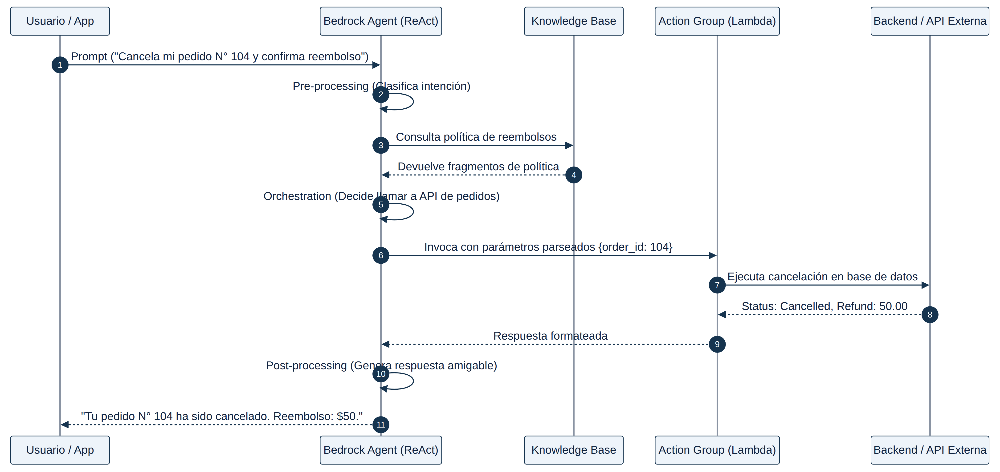

## MÓDULO 3: AGENTES AUTÓNOMOS Y ORQUESTACIÓN (AGENTS & FLOWS)

Empatado con RAG como el bloque más examinado (20 de 97 preguntas), este módulo es también el más heterogéneo: bajo el paraguas de "agentes" el examen agrupa desde el patrón clásico ReAct de Amazon Bedrock Agents hasta la orquestación puramente determinista con AWS Step Functions, la gestión de configuración dinámica con AWS AppConfig, la plataforma agéntica de nueva generación AgentCore, y la integración con servidores del Model Context Protocol (MCP). El hilo conductor de casi todas las preguntas es una tensión constante: **¿este problema necesita razonamiento autónomo de un FM, o es en realidad un flujo de pasos fijos y predecibles que se resuelve mejor con orquestación determinista?** Elegir la herramienta equivocada para esa pregunta es el origen de la mayoría de los distractores.

### 3.1 Anatomía de un Amazon Bedrock Agent

Un **Amazon Bedrock Agent** extiende un FM con la capacidad de razonar mediante el patrón **ReAct (Reasoning + Acting)**: en cada turno, el agente decide si responde directamente, si debe consultar una **Knowledge Base** asociada (RAG automatizado para preguntas informativas) o si debe invocar una acción de un **Action Group**. Un *action group* se define mediante un **esquema OpenAPI** (JSON/YAML en S3) que describe endpoints, métodos y parámetros, y tiene dos mecanismos de ejecución:

- **AWS Lambda**: Bedrock invoca automáticamente la función y usa el resultado en el siguiente paso de razonamiento.
- **Return of Control (RoC)**: Bedrock devuelve el control a la aplicación cliente —el nombre de la función y los parámetros estructurados— sin invocar nada por sí mismo. Es la respuesta correcta cuando el enunciado exige ejecutar la acción en un entorno **on-premises o local** sin exponer credenciales a AWS.

El **ciclo de vida** de una invocación tiene tres fases —*pre-processing* (clasifica la intención), *orchestration* (razona, invoca acciones y consulta la KB) y *post-processing* (formatea la respuesta final)— y cada fase emite **trace events** que documentan el razonamiento, útiles como pista de auditoría nativa sin instrumentación adicional (ver Módulo 5). La memoria de sesión (`sessionId`, por defecto hasta 1 hora) mantiene el contexto multi-turno sin que el desarrollador gestione una base de datos externa, y la memoria a largo plazo resume sesiones anteriores para personalizar interacciones futuras.

### 3.2 Multi-Agent Collaboration: el patrón jerárquico Supervisor–Colaborador

Cuando un escenario describe **múltiples dominios especializados** (clínico, seguros, citas, reclamaciones) que deben escalar de forma independiente sin degradarse entre sí, la arquitectura documentada por AWS es **jerárquica**: un **Supervisor Agent** recibe la consulta, clasifica la intención en lenguaje natural y **enruta** hacia el **Collaborator Agent** especializado correspondiente. Cada agente del equipo —incluido el supervisor— puede tener sus propias herramientas, *action groups*, **Knowledge Base** y guardrails, lo que permite **aislar los datos de cada dominio** en bases de conocimiento independientes con control de acceso propio.

⚠ Regla de Examen

En Multi-Agent Collaboration, quien clasifica y enruta es siempre el <strong>supervisor</strong>, nunca los colaboradores. Un diseño con un supervisor por departamento, con traspasos manuales entre supervisores, o con un único agente "genérico" que enruta mediante reglas dentro de sus propias instrucciones, invierte el patrón documentado o renuncia a la especialización — ambos son distractores recurrentes.

### 3.3 Amazon Bedrock AgentCore: cuando construir el agente a mano ya no compensa

Para requisitos de **memoria persistente, identidad/autenticación, invocación tanto síncrona como dirigida por eventos, y observabilidad**, combinados con la exigencia de **máxima escalabilidad y mínimo código de orquestación propio**, la plataforma de referencia es **Amazon Bedrock AgentCore**, con cuatro piezas clave:

- **AgentCore Memory**: memoria a corto y largo plazo, persistente entre sesiones y compartible entre agentes — sin tabla de DynamoDB que diseñar y mantener a mano.
- **AgentCore Identity**: gestión de identidad, autenticación y autorización compatible con proveedores externos (Cognito, Okta, Entra ID).
- **AgentCore Runtime**: aislamiento de sesión mediante microVMs dedicadas, con soporte para invocación síncrona (`InvokeAgentRuntime`) y para procesamiento asíncrono/dirigido por eventos.
- **AgentCore Gateway**: convierte APIs existentes (por ejemplo, REST APIs de Amazon API Gateway) y funciones Lambda en herramientas compatibles con **Model Context Protocol (MCP)** con mínima configuración, centralizando el descubrimiento de herramientas y la autenticación de entrada/salida sin código de orquestación personalizado.

Caso de Estudio — Cuándo AgentCore gana frente a "construirlo con Step Functions + DynamoDB"

Un agente de razonamiento sobre Lambda y REST APIs necesita preservar memoria entre interacciones, compartir estado entre agentes, soportar invocación tanto síncrona como dirigida por eventos, y aplicar control de acceso por sesión — con la <strong>máxima escalabilidad</strong>. Una arquitectura con Amazon Bedrock Agents clásico más AWS Step Functions, colas SQS y una tabla DynamoDB para el estado es funcionalmente válida, pero exige diseñar y mantener manualmente toda la persistencia de memoria y el control de sesión. AgentCore resuelve las mismas garantías (memoria, identidad, eventos, observabilidad) como servicio gestionado, y AgentCore Gateway conecta las Lambda y REST APIs existentes como herramientas MCP sin escribir código de orquestación — la combinación de menor esfuerzo y mayor escalabilidad.

### 3.4 Orquestación determinista con AWS Step Functions

Cuando el problema es en realidad una **secuencia de pasos predecible** —no un agente que debe decidir dinámicamente qué hacer— Step Functions es, con enorme frecuencia, la respuesta correcta frente a construir esa lógica con Lambda "a mano" o, peor, forzarla dentro de un agente de Bedrock. Cuatro capacidades nativas aparecen una y otra vez:

- **Estado `Parallel`**: ejecuta varias ramas del flujo de trabajo **simultáneamente**. Es la respuesta cuando el cuello de botella es la suma de latencias de llamadas secuenciales a un FM (por ejemplo, tres análisis independientes de un mismo informe): al paralelizar, el tiempo total pasa de la suma de las partes al tiempo de la rama más lenta. Ni la concurrencia aprovisionada de Lambda ni el auto-scaling de ECS resuelven este cuello de botella si el código interno sigue procesando de forma secuencial — el problema es de **paralelismo lógico**, no de capacidad de cómputo.
- **`Retry` y `Catch`** en cada estado `Task`: reintentos con backoff configurable ante errores transitorios y enrutamiento a un estado de *fallback* cuando se agotan los reintentos — la forma nativa y declarativa de lograr "degradación agraciada" sin escribir lógica de reintento a mano. Cuando un escenario pide resiliencia entre varios pasos secuenciales (por ejemplo, tres agentes de Bedrock más una Lambda de cálculo), la granularidad correcta es **un `Task` por componente**, cada uno con su propio `Retry`/`Catch` — envolver todo en una única Lambda orquestadora con un solo bloque de manejo de errores pierde granularidad y trazabilidad por componente.
- **`waitForTaskToken` ("Wait for a Callback with the Task Token")**: pausa la ejecución del *state machine* — sin consumir cómputo — hasta que un proceso externo llama a `SendTaskSuccess`/`SendTaskFailure` con el token de tarea. Es el patrón nativo para **aprobación humana** (un técnico revisa una recomendación generada por IA antes de aplicarla) y solo está disponible en flujos **Standard** (duraderos, hasta un año de ejecución, semántica *exactly-once*); los flujos **Express** (hasta 5 minutos, alto volumen, *at-least-once*) no soportan callbacks duraderos ni conservan historial completo de ejecución, por lo que son la elección correcta solo para procesamiento de alto volumen y corta duración sin necesidad de pausas.
- **Integraciones optimizadas de servicio**: Step Functions invoca de forma nativa `bedrock:invokeModel`, operaciones de S3 (`GetObject`/`PutObject`) y, mediante la integración con el SDK de AWS, prácticamente cualquier API de más de 200 servicios (incluido `comprehend:DetectPiiEntities`) — sin funciones Lambda intermedias para un flujo lineal de leer-transformar-invocar-escribir. Cuando sí se necesita lógica de transformación no trivial (construir un prompt dinámico a partir de una transcripción, dar forma a una salida estructurada), una Lambda intermedia sigue siendo necesaria; el error de examen es usar una Lambda cuando no aporta nada, o evitarla cuando es imprescindible para la flexibilidad requerida.

⚠ Regla de Examen — El límite de 256 KiB entre estados

Cuando la salida entre estados de Step Functions supera el límite de 256 KiB (por ejemplo, trazas de razonamiento extensas de agentes encadenados), la práctica documentada por AWS es usar los campos opcionales <code>Input.S3Uri</code> / <code>Output.S3Uri</code> de la integración con Bedrock para leer/escribir el payload grande directamente en Amazon S3, combinados con <code>ResultSelector</code> y <code>ResultPath</code> para enrutar solo la referencia (pequeña) entre estados — sin añadir DynamoDB, sin comprimir/descomprimir con Lambda, y sin fragmentar el flujo en varias máquinas de estado coordinadas por EventBridge (lo que rompería la observabilidad de una única ejecución).

Un matiz recurrente: Step Functions **no** ofrece de forma nativa un mecanismo de *traffic-shifting* ponderado entre versiones de modelo de Bedrock (a diferencia de los *endpoint variants* de SageMaker, que no aplican a Bedrock). Para un despliegue canario de versiones de modelo con verificación de métricas y rollback automático, el patrón correcto es **Provisioned Throughput** para alojar cada versión más un flujo de **Step Functions Standard** disparado por EventBridge que desplaza tráfico en fases, consulta CloudWatch entre fases y decide avanzar o revertir — construido a medida porque Bedrock no expone ese enrutamiento por sí solo.

**Disparo de flujos por eventos de S3**: Amazon S3 **no** puede invocar directamente una máquina de estados de Step Functions como destino nativo de sus notificaciones de evento (solo SNS, SQS, Lambda o EventBridge). El patrón correcto para arrancar un flujo "en cuanto se sube un archivo" es habilitar las notificaciones de S3 hacia **Amazon EventBridge** y crear una regla que use la máquina de estados como destino — nunca una integración directa S3→Step Functions.

### 3.5 Bedrock Flows frente a Step Functions: dos orquestadores, dos propósitos

**Amazon Bedrock Flows** es un lienzo visual para flujos generativos deterministas mediante un grafo de nodos: *Prompt nodes* (invocación de un FM con una plantilla parametrizada), *Knowledge Base nodes* (consulta RAG), *Condition/Branching nodes*, *Lambda nodes* y nodos de almacenamiento en S3 (lectura y escritura). Es la elección natural cuando el flujo es sencillo y se beneficia de edición visual y de la integración nativa con el resto del ecosistema Bedrock (prompts gestionados, KB, agentes). El matiz de examen: un **nodo de agente** dentro de un Flow invoca un **Agente de Bedrock completo**, con su propia orquestación y memoria — no es el nodo adecuado para una simple llamada de inferencia (para eso existe el **nodo Prompt**). Cuando el flujo necesita construir dinámicamente prompts complejos con funciones intrínsecas, invocar decenas de servicios de AWS por su SDK, o requiere ejecuciones de larga duración con reintentos granulares por paso, **AWS Step Functions** ofrece más control y mejor integración con el resto de la plataforma AWS.

### 3.6 Configuración dinámica sin redespliegue: AWS AppConfig

Un patrón que se repite bajo distintos disfraces —enrutamiento de modelos por nivel de cliente, A/B testing de prompts, cambio de proveedor de modelo en tiempo real— comparte siempre el mismo requisito de fondo: **cambiar comportamiento sin desplegar código nuevo, con validación previa y capacidad de revertir**. **AWS AppConfig** (una capacidad de Systems Manager) es la respuesta nativa:

- **Feature flags** nativos para pruebas A/B y activación/desactivación de funcionalidades.
- **Validadores** (JSON Schema o Lambda personalizada) que comprueban la validez de un parámetro (por ejemplo, `temperature` o el límite máximo de tokens) **antes** de desplegar el cambio.
- **Estrategias de despliegue** graduales (por ejemplo, `Linear20PercentEvery6Minutes`) con **rollback automático** integrado con alarmas de CloudWatch si la salud de la aplicación se degrada durante el despliegue.
- El **AWS AppConfig Agent** (una capa/extensión de Lambda) expone la configuración vía un endpoint HTTP local (`localhost:2772`) con caché local, evitando llamadas repetidas al servicio y manteniendo baja la latencia añadida.

⚠ Regla de Examen

Frente a AWS Systems Manager Parameter Store, Amazon DynamoDB o Amazon ElastiCache como almacén de configuración: ninguno de los tres ofrece de forma <strong>nativa</strong> validadores de esquema, estrategias de despliegue gradual ni rollback automático basado en alarmas. Si el enunciado menciona explícitamente "validar antes de aplicar", "pruebas A/B sin redespliegue" o "revertir automáticamente si las métricas se degradan", la respuesta es <strong>AWS AppConfig</strong> — variables de entorno de Lambda, Parameter Store o un archivo en S3 leído directamente son casi siempre el distractor, incluso cuando "también" resuelven la lectura dinámica de configuración.

### 3.7 Model Context Protocol (MCP): transporte, hospedaje y autenticación

Cuando un agente necesita invocar herramientas especializadas expuestas como servidores MCP, el examen distingue con precisión dos ejes: **transporte** y **hospedaje**.

- **STDIO** es un transporte **local**, para procesos que se ejecutan en la misma máquina (entrada/salida estándar) — no aplica para invocar de forma remota una función Lambda a través de la red, y no requiere autenticación entre cliente y servidor porque ambos comparten proceso/máquina.
- **Streamable HTTP** (JSON-RPC 2.0 sobre HTTP POST) es el transporte para servidores **remotos** — el que corresponde a un servidor MCP desplegado como función Lambda expuesta a través de la red.

Sobre el hospedaje remoto, dos patrones válidos con matices de coste/control distintos:

- **Lambda + Amazon API Gateway**, con **Amazon Cognito** delante para emitir y validar tokens **OAuth 2.1** — el patrón documentado cuando se necesita interoperar con **terceros externos** bajo un estándar de autorización ampliamente soportado.
- **Lambda Function URLs** con `InvokeMode = RESPONSE_STREAM` (para soportar el streaming que exige el transporte) y `AuthType = AWS_IAM` (autenticación por **SigV4**, con permisos `lambda:InvokeFunctionUrl` en políticas de identidad o de recursos para acceso cross-account) — la alternativa de **menor esfuerzo operativo** cuando no se necesitan las capacidades adicionales de API Gateway (planes de uso, autorizadores personalizados, dominios propios), tanto para consumidores internos como para socios externos autorizados mediante políticas de recursos.

⚠ Regla de Examen

Las claves de API de Amazon API Gateway están pensadas para identificación y limitación de uso (<em>throttling</em>), no para autenticación/autorización fuerte — si el enunciado exige "controles estrictos de autenticación y autorización", una opción que solo propone API keys es un distractor. Del mismo modo, invocar la función Lambda de un servidor MCP de forma <strong>asíncrona</strong>, o mediante la API <code>Invoke</code> de control en lugar de un transporte HTTP real, rompe el modelo síncrono de petición-respuesta JSON-RPC que exige MCP.

### 3.8 Datos estructurados frente a no estructurados: RAG no siempre es la respuesta

Un escenario recurrente combina un requisito de personalización con datos que ya viven en una base de datos **relacional** (por ejemplo, historial de reservas en Amazon RDS). La tentación es convertir esos datos en embeddings y aplicar RAG — pero la documentación de AWS es explícita: para datos **estructurados**, la vía recomendada es **text-to-SQL** (traducir la pregunta en lenguaje natural a una consulta SQL, con **validación de la consulta generada** antes de ejecutarla), porque preserva la exactitud transaccional (sumas, fechas exactas, estados) que la búsqueda semántica por similitud no garantiza. Bedrock Knowledge Bases para **almacenes de datos estructurados** se conecta de forma nativa a Amazon Redshift o al AWS Glue Data Catalog — no directamente a Amazon RDS — reforzando que RDS transaccional no es, por defecto, una fuente de una KB de Bedrock. La combinación de examen para reducir alucinaciones sobre datos estructurados es **text-to-SQL con validación de la consulta + guardrails de Bedrock + un flujo determinista de validación (Step Functions/Lambda)** — no "confidence scoring" ni "búsqueda por similitud semántica", que no tienen sentido metodológico sobre datos tabulares exactos.

### Fuentes

- https://docs.aws.amazon.com/bedrock/latest/userguide/agents-how.html
- https://docs.aws.amazon.com/bedrock/latest/userguide/trace-events.html
- https://docs.aws.amazon.com/bedrock/latest/userguide/agents-multi-agent-collaboration.html
- https://docs.aws.amazon.com/bedrock/latest/userguide/create-multi-agent-collaboration.html
- https://docs.aws.amazon.com/bedrock-agentcore/latest/devguide/what-is-bedrock-agentcore.html
- https://docs.aws.amazon.com/bedrock-agentcore/latest/devguide/gateway.html
- https://docs.aws.amazon.com/bedrock-agentcore/latest/devguide/runtime-sessions.html
- https://docs.aws.amazon.com/bedrock-agentcore/latest/devguide/runtime-mcp.html
- https://docs.aws.amazon.com/step-functions/latest/dg/connect-bedrock.html
- https://docs.aws.amazon.com/step-functions/latest/dg/state-parallel.html
- https://docs.aws.amazon.com/step-functions/latest/dg/concepts-error-handling.html
- https://docs.aws.amazon.com/step-functions/latest/dg/tutorial-human-approval.html
- https://docs.aws.amazon.com/step-functions/latest/dg/input-output-resultpath.html
- https://docs.aws.amazon.com/step-functions/latest/dg/tutorial-cloudwatch-events-s3.html
- https://docs.aws.amazon.com/wellarchitected/latest/serverless-applications-lens/step-functions-workflows.html
- https://docs.aws.amazon.com/bedrock/latest/userguide/flows-nodes.html
- https://docs.aws.amazon.com/appconfig/latest/userguide/what-is-appconfig.html
- https://docs.aws.amazon.com/appconfig/latest/userguide/appconfig-integration-lambda-extensions.html
- https://docs.aws.amazon.com/appconfig/latest/userguide/appconfig-creating-deployment-strategy.html
- https://docs.aws.amazon.com/appconfig/latest/userguide/appconfig-creating-configuration-and-profile-validators.html
- https://docs.aws.amazon.com/prescriptive-guidance/latest/mcp-deployment-patterns-on-aws/deployment-pattern-2-aws-lambda-amazon-api-gateway.html
- https://docs.aws.amazon.com/prescriptive-guidance/latest/mcp-strategies/mcp-hosting-strategy.html
- https://docs.aws.amazon.com/lambda/latest/dg/urls-auth.html
- https://docs.aws.amazon.com/lambda/latest/dg/apig-http-invoke-decision.html
- https://docs.aws.amazon.com/bedrock/latest/userguide/kb-how-data.html
- https://docs.aws.amazon.com/bedrock/latest/userguide/knowledge-base-generate-query.html
- https://docs.aws.amazon.com/bedrock/latest/userguide/kb-data-source-sync-ingest.html

<figure class="diagram">

<figcaption>Ciclo de vida de una invocación a un Amazon Bedrock Agent: pre-processing, orquestación (ReAct) con Knowledge Base y Action Group, y post-processing.</figcaption>
</figure>
