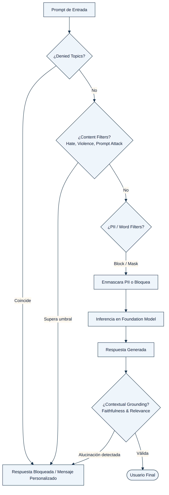

## MÓDULO 4: GUARDRAILS, SEGURIDAD Y FILTRADO DE CONTENIDO

**Amazon Bedrock Guardrails** implementa salvaguardas independientes del modelo para filtrar entradas maliciosas y salidas no deseadas, aplicables a modelos, agentes, *knowledge bases* e incluso modelos fuera de Bedrock mediante la API `ApplyGuardrail`. Con 11 preguntas dedicadas, este módulo premia sobre todo la **precisión terminológica**: cada componente de un guardrail resuelve un problema distinto y comparte fronteras muy finas con sus vecinos — confundir "bloquear un tema" con "filtrar contenido dañino", o "enmascarar PII" con "bloquearla", es exactamente el tipo de error que el examen está diseñado para detectar.

<figure class="diagram">

<figcaption>Orden de evaluación de un Guardrail: temas denegados → filtros de contenido → información sensible/filtros de palabras → inferencia → contextual grounding.</figcaption>
</figure>

### 4.1 Los cinco componentes y su frontera exacta

| Componente | Qué detecta | Matiz que el examen explota |
| :--- | :--- | :--- |
| **Denied Topics** | Temas definidos semánticamente en lenguaje natural (nombre, definición de hasta 200 caracteres, hasta 5 frases de ejemplo). | Es la herramienta para bloquear **intenciones de negocio** ("asesoramiento de inversión concreto", "temas fuera de dominio") — no para nombres propios ni listas léxicas exactas (eso son *word filters*). |
| **Content Filters** | 6 categorías predefinidas de daño: *Hate, Insults, Sexual, Violence, Misconduct, Prompt Attack*. Severidad configurable por separado para input/output: None, Low, Medium, High. | **Insults** incluye explícitamente lenguaje de *bullying*; **Hate** es discriminación por identidad — no cubre acoso general. No existe una categoría de "patrones de alucinación": eso es el *contextual grounding check*, no un content filter. |
| **Sensitive Information Filters (PII)** | Entidades PII predefinidas + regex personalizados. Acciones: **Block** o **Mask (ANONYMIZE)**, configurables por separado para input (`InputAction`) y output (`OutputAction`). | Si la conversación debe **continuar** sin exponer PII → **Mask**. Si debe **impedirse por completo** que un dato llegue al modelo o al usuario → **Block**. Mask en producción para PII expuesta al usuario final es casi siempre incorrecto si el requisito real es "que la PII no llegue al cliente". |
| **Word Filters** | Coincidencia léxica exacta — nombres de competidores, marcas, listas CSV desde S3 (hasta 10.000 términos). | Explícitamente documentado por AWS para bloquear "contenido con nombres de competidores o productos" — un *content filter* no detecta coincidencias léxicas de nombres propios. |
| **Contextual Grounding Check** | **Grounding Score** (fidelidad a la fuente de referencia) y **Relevance Score** (pertinencia a la pregunta), umbral 0.0–0.99. | Umbral **alto** = menos alucinaciones permitidas (más estricto). Un umbral **bajo** deja pasar respuestas poco fundamentadas — es el distractor cuando el requisito es "ceñirse a la guía aprobada". |

Caso de Estudio — Tres controles para tres riesgos distintos

Una entidad financiera necesita bloquear conversaciones sobre asesoramiento de inversión concreto, impedir que se mencione a la competencia, y garantizar que las respuestas no contengan afirmaciones no respaldadas por su guía aprobada. Ningún control por sí solo cubre los tres riesgos: los <strong>denied topics</strong> bloquean la intención semántica de pedir consejo de inversión; los <strong>word filters</strong> con los nombres de competidores en modo block impiden su mención literal; y un <strong>umbral alto de Grounding Score</strong> en el contextual grounding check bloquea afirmaciones no ancladas en la guía financiera aprobada. Ni los content filters (pensados para odio/violencia/insultos, no para intención de negocio) ni un umbral bajo de grounding (que permite más alucinaciones, no menos) resuelven estos requisitos.

### 4.2 Calibrar la severidad: por qué "High" no siempre es la respuesta correcta

Un matiz de examen contraintuitivo: en los *content filters*, el nivel **High** bloquea contenido con confianza **HIGH, MEDIUM y LOW** (solo deja pasar confianza NONE) — es la configuración más agresiva y la que genera **más falsos positivos**. El nivel **Medium** bloquea únicamente confianza HIGH y MEDIUM, dejando pasar LOW y NONE — el punto de equilibrio cuando el enunciado pide explícitamente "aplicar políticas eficazmente **con mínimos falsos positivos**". Si el escenario no menciona restricciones sobre falsos positivos, High es razonable para contenido de alto riesgo (por ejemplo, ataques de *prompt injection* sofisticados); si sí las menciona, Medium — combinado con *denied topics* bien definidos y filtros de información sensible con acciones diferenciadas por dirección (mask en output, block en input) — es la respuesta que ofrece múltiples estrategias de tratamiento sin sacrificar precisión.

Del mismo modo, la acción de un *content filter* no es binaria entre "bloquear" o "nada": la opción **Detect** (sin acción) registra e identifica el contenido dañino para seguimiento y alerta, pero **deja pasar la respuesta** — la respuesta correcta cuando el enunciado dice explícitamente "notificar pero no bloquear todas las respuestas señaladas".

### 4.3 `ApplyGuardrail`: guardrails desacoplados de la inferencia

Un guardrail no tiene por qué invocarse únicamente como parte de una llamada a `Converse`/`InvokeModel`. La API **`ApplyGuardrail`** evalúa contenido de forma **independiente y desacoplada** de cualquier invocación de modelo — se le pasa el `guardrailIdentifier` y el contenido a evaluar, en cualquier punto del flujo de la aplicación. Esto habilita un patrón de examen recurrente: **aplicar dinámicamente un guardrail distinto según el rol del usuario autenticado** (por ejemplo, con grupos de Amazon Cognito) sobre la salida de una única Knowledge Base compartida — un guardrail que enmascara PII para el grupo "ingenieros" y otro que la deja pasar para el grupo "cirujanos" — sin duplicar la base de conocimiento ni el almacenamiento. Duplicar la KB con una copia redactada y otra sin redactar, o redactar la PII de forma permanente en el documento de origen (lo que la destruiría también para quienes sí deben verla), son distractores típicos que ignoran que `ApplyGuardrail` permite decidir en tiempo de consulta, no en tiempo de ingesta.

### 4.4 Guardrails cross-Region: resiliencia sí, residencia estricta no

Un **guardrail profile** habilita **inferencia cross-Region para la evaluación de la política del guardrail** — de forma análoga a los *inference profiles* de modelos, enruta las evaluaciones entre regiones de la misma geografía para dar continuidad si una región no está disponible, sin coste adicional. Pero la documentación de AWS es explícita en un matiz que el examen usa como trampa: aunque la **configuración** del guardrail vive en la región principal, los **prompts de entrada y las respuestas de salida evaluados pueden moverse fuera de esa región principal** durante la inferencia cross-Region. Por tanto:

⚠ Regla de Examen

Si el requisito es <strong>resiliencia/failover</strong> ante una interrupción regional, un <strong>guardrail profile cross-Region</strong> es la respuesta correcta. Si el requisito es que el procesamiento ocurra <strong>exactamente</strong> en la misma región donde está el cliente (residencia de datos estricta, no solo "dentro de la misma geografía"), un guardrail cross-Region viola ese requisito — la respuesta correcta es <strong>desplegar una copia independiente del guardrail en cada región</strong> donde opera la empresa.

### 4.5 Guardrails y moderación multimodal / de contenido generado por usuarios

Los *content filters* y los filtros de información sensible de Bedrock Guardrails cubren tanto **texto como imágenes**, y pueden combinarse con servicios de IA especializados cuando el contenido de entrada no es texto: **Amazon Rekognition** (`DetectModerationLabels`) para moderación de imágenes, y **Amazon Comprehend** (`DetectPiiEntities`/`StartPiiEntitiesDetectionJob`) para PII en texto no gestionado por Bedrock. Orquestar estos servicios gestionados con **AWS Step Functions** —sin entrenar modelos propios en SageMaker ni construir clasificadores a medida— es el patrón de menor sobrecarga de infraestructura para pipelines de moderación de contenido generado por usuarios (imágenes + texto subidos a un flujo respaldado por S3).

Un matiz importante sobre **Amazon Comprehend Trust and Safety** (`DetectToxicContent`, clasificación de seguridad de prompts): AWS ha discontinuado la disponibilidad de la **clasificación de seguridad de prompts de Comprehend para clientes nuevos**, y recomienda explícitamente usar **Amazon Bedrock Guardrails** para esa capacidad en implementaciones nuevas. Si una opción de examen describe una arquitectura *nueva* apoyada en esa funcionalidad concreta de Comprehend, es una señal de que Bedrock Guardrails es probablemente la alternativa más alineada con la documentación vigente — aunque la detección de toxicidad y de PII de Comprehend siguen siendo válidas y utilizables en paralelo (no en cadena secuencial, para minimizar la latencia acumulada antes de que el contenido llegue al FM).

### 4.6 Guardrails no sustituyen el anclaje factual: RAG y grounding trabajan juntos

Un guardrail impide que una respuesta dañina o no fundamentada **salga**, pero no aporta por sí solo el contexto factual que evita que el modelo **especule**. Cuando el requisito combina "no debe generar interpretaciones especulativas" con "debe basarse en datos empíricos reales" (por ejemplo, un asistente de investigación sobre comportamiento animal a partir de sensores y grabaciones), la arquitectura correcta combina **RAG** (una Knowledge Base con los resúmenes/transcripciones reales, que ancla la respuesta en los registros) **con** el *contextual grounding check* o *denied topics* de Guardrails para restringir explícitamente las salidas especulativas — ninguna de las dos piezas sola es suficiente: sin RAG, el guardrail no tiene nada contra qué "anclar" la respuesta; sin guardrail, RAG reduce pero no elimina la posibilidad de que el modelo añada interpretación no soportada por el contexto recuperado.

### 4.7 Gobernanza de prompts y guardrails como un único paquete gestionado

Cuando el requisito combina **formato de respuesta consistente**, **tono adaptado por audiencia** y **moderación de contenido**, con el objetivo de **minimizar la orquestación y el mantenimiento de post-procesamiento propio**, la combinación de referencia es **Amazon Bedrock Prompt Management** (plantillas reutilizables con variables, versionadas, una por unidad de negocio o audiencia) **+ Amazon Bedrock Guardrails** (content filters por categoría, word filters, sensitive information filters) — ambos servicios completamente gestionados, sin funciones Lambda de post-procesamiento, sin tablas de reglas en DynamoDB, y sin necesidad de una "API de administración" propia para ajustar los criterios de moderación en el tiempo: se edita la configuración del guardrail o de la plantilla directamente.

### Fuentes

- https://docs.aws.amazon.com/bedrock/latest/userguide/guardrails.html
- https://docs.aws.amazon.com/bedrock/latest/userguide/guardrails-denied-topics.html
- https://docs.aws.amazon.com/bedrock/latest/userguide/guardrails-content-filters.html
- https://docs.aws.amazon.com/bedrock/latest/userguide/guardrails-content-filters-overview.html
- https://docs.aws.amazon.com/bedrock/latest/userguide/guardrails-word-filters.html
- https://docs.aws.amazon.com/bedrock/latest/userguide/guardrails-sensitive-filters.html
- https://docs.aws.amazon.com/bedrock/latest/userguide/guardrails-contextual-grounding-check.html
- https://docs.aws.amazon.com/bedrock/latest/userguide/guardrails-prompt-attack.html
- https://docs.aws.amazon.com/bedrock/latest/userguide/guardrails-cross-region.html
- https://docs.aws.amazon.com/bedrock/latest/userguide/guardrails-use-independent-api.html
- https://docs.aws.amazon.com/bedrock/latest/APIReference/API_runtime_ApplyGuardrail.html
- https://docs.aws.amazon.com/bedrock/latest/userguide/monitoring-guardrails-cw-metrics.html
- https://docs.aws.amazon.com/bedrock/latest/userguide/prompt-management.html
- https://docs.aws.amazon.com/bedrock/latest/userguide/model-invocation-logging.html
- https://docs.aws.amazon.com/bedrock/latest/userguide/kb-multimodal.html
- https://docs.aws.amazon.com/rekognition/latest/dg/procedure-moderate-images.html
- https://docs.aws.amazon.com/comprehend/latest/dg/trust-safety.html
- https://docs.aws.amazon.com/comprehend/latest/dg/how-pii.html
- https://docs.aws.amazon.com/comprehend/latest/dg/comprehend-availability-change.html
