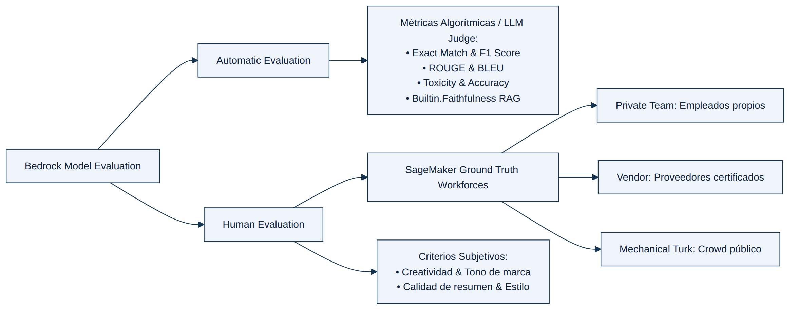

## MÓDULO 5: MONITORIZACIÓN, TRAZABILIDAD Y EVALUACIÓN DE MODELOS

La monitorización de aplicaciones de IA generativa tiene una particularidad que la distingue de la observabilidad tradicional de software: no basta con saber que un servicio responde rápido y sin errores HTTP; hay que saber si lo que responde es **correcto, fiel a sus fuentes y justo**. Este módulo cubre las dos caras de esa moneda —evaluación de calidad y observabilidad operativa— y es, junto con Seguridad y RAG, uno de los bloques con más peso real en el examen. La clave para superar sus preguntas no es memorizar servicios sueltos, sino entender qué mide exactamente cada herramienta y, sobre todo, qué NO mide, porque casi todos los distractores del examen consisten en aplicar la herramienta correcta a la métrica equivocada, o una herramienta reactiva donde se pedía algo proactivo/automático.

### 5.1 Model Evaluation en Amazon Bedrock: automática vs. humana

Amazon Bedrock Evaluations permite comparar el rendimiento de distintos FMs (o distintas variantes de prompt) frente a un conjunto de datos de entrada, sin necesidad de construir un pipeline de evaluación propio. Existen dos modalidades:

- **Automatic Evaluation:** aplica métricas algorítmicas y de referencia (Exact Match, F1, ROUGE/BLEU, Toxicity, Accuracy, Robustness) o, de forma más moderna, un **modelo evaluador ("LLM-as-a-judge")** —una versión soportada de Anthropic Claude, Amazon Nova u otro modelo autorizado como juez— que puntúa las respuestas y devuelve tanto la puntuación como una explicación textual del porqué. Esta modalidad es la respuesta correcta siempre que el enunciado pida objetividad, reproducibilidad y **procesamiento a escala sin intervención manual**.
- **Human Evaluation:** se apoya en **SageMaker Ground Truth Workforces**, con tres orígenes de anotadores posibles: **Private Team** (empleados propios, para datos sensibles o dominios muy especializados), **Vendor** (proveedores certificados por AWS) y **Mechanical Turk** (multitud pública, solo para tareas no sensibles). Es la respuesta correcta cuando el criterio a evaluar es inherentemente subjetivo: tono de marca, adecuación cultural, creatividad, o calidad de un resumen que ningún score automático puede capturar bien.

Un matiz que el examen explota con frecuencia: **combinar ambas modalidades no es redundante, es la mejor práctica**. Un patrón recurrente en los escenarios reales es un sistema híbrido donde el LLM-as-a-judge cribe automáticamente el grueso del tráfico y solo los casos marcados como límite o de alto riesgo (por ejemplo, en un dominio clínico o financiero) pasen a revisión humana dirigida —normalmente mediante **Amazon Augmented AI (Amazon A2I)**, que permite configurar "human review workflows" que se activan solo ante ciertas condiciones—. Esta arquitectura reduce drásticamente el coste de revisión manual sin renunciar a una red de seguridad humana en los casos que importan.

Bedrock también ofrece **evaluaciones específicas para RAG**, con dos tipos de trabajo bien diferenciados que el examen distingue con precisión quirúrgica:

- **Retrieve-only:** evalúa exclusivamente la calidad de la recuperación de la base de conocimiento, con métricas integradas como *Context Relevance* (¿los fragmentos recuperados son relevantes?) y *Context Coverage*. No invoca ni evalúa el modelo generador.
- **Retrieve-and-generate:** evalúa el sistema completo, incluida la respuesta generada, con la métrica *Builtin.Faithfulness* (mide explícitamente si la respuesta evita alucinar respecto a los pasajes recuperados) y métricas de comparación con una respuesta de referencia como *Builtin.Correctness* y *Builtin.Relevance*. Si el enunciado exige comparar la **calidad de generación** entre dos FMs o dos estrategias de chunking, la opción correcta siempre pasa por un trabajo *retrieve-and-generate*, nunca por uno *retrieve-only*. Además, cada trabajo de evaluación RAG de Bedrock se define contra una única fuente RAG (`knowledgeBaseId` o `ragSourceIdentifier`) y un único modelo generador, así que comparar varias estrategias de chunking o varios FMs a la vez implica en la práctica ejecutar **varios trabajos** y comparar después sus resultados.

Para el acceso a datos, hay un detalle que aparece explícitamente en el examen: el bucket de S3 con los datasets de entrada solo necesita permisos de IAM adecuados para el rol de servicio de Bedrock; **la configuración de CORS solo es obligatoria en evaluaciones con revisión humana** (para que el portal de anotadores pueda renderizar los prompts en el navegador), no en evaluaciones automáticas. Añadir un VPC endpoint tampoco es necesario salvo que el tráfico deba permanecer dentro de una VPC sin salida a Internet.

### 5.2 Framework RAGAS y evaluación LLM-as-a-Judge en producción

Cuando un sistema RAG ya está en producción y se quiere medir su calidad de forma continua (no solo en un trabajo de evaluación puntual), la industria converge en el framework conceptual **RAGAS** (*Retrieval Augmented Generation Assessment*), que descompone la calidad en tres ejes:

$$\text{Calidad RAG} = f(\text{Context Relevance}, \text{Faithfulness}, \text{Answer Relevance})$$

1. **Context Relevance:** ¿los fragmentos que trajo la base vectorial son relevantes para la pregunta, sin ruido?
2. **Faithfulness / Groundedness:** ¿todas las afirmaciones de la respuesta se pueden deducir del contexto recuperado? Es la métrica anti-alucinación por excelencia.
3. **Answer Relevance:** ¿la respuesta atiende realmente a la pregunta formulada, con independencia de si el contexto era completo?

Estos mismos tres ejes son, en esencia, los que Bedrock Evaluations materializa con sus métricas integradas (Context Relevance/Coverage, Faithfulness, Correctness/Relevance), y también los que se pueden replicar con métricas personalizadas: Bedrock permite definir hasta 10 métricas por trabajo de evaluación, cada una con su propio prompt de instrucciones para el modelo juez y su propio esquema de puntuación (por ejemplo, una escala de 1 a 5), lo que permite construir métricas a medida como "precision at k" para escenarios muy específicos, como comparar múltiples estrategias de chunking entre sí.

### 5.3 Amazon SageMaker Clarify: sesgo, equidad y deriva

**SageMaker Clarify** es el servicio de AWS diseñado específicamente para el análisis de **sesgo (bias)** y **equidad (fairness)**, y es un tema que reaparece en el examen con enunciados que, a primera vista, parecen de observabilidad pero en realidad piden equidad estadística. La señal inequívoca es cualquier mención a "grupos demográficos", "disparidad entre segmentos" o "favorecido/desfavorecido": ahí, la respuesta casi siempre es Clarify, no Guardrails ni CloudWatch a secas.

Clarify distingue dos momentos de análisis. Las **métricas pre-entrenamiento** se calculan sobre el dataset crudo, antes de entrenar o invocar ningún modelo, y responden a la pregunta "¿los propios datos ya están desequilibrados entre grupos?"; ejemplos típicos son el **Class Imbalance (CI)** (desequilibrio en el tamaño de cada facet) o la **Difference in Proportions of Labels (DPL)** (diferencia en la proporción de resultados positivos observados entre el grupo favorecido y el desfavorecido). Las **métricas post-entrenamiento** —hasta **once** métricas distintas— se calculan sobre las predicciones del modelo ya entrenado (o sobre las respuestas de un modelo generativo) y cuantifican si el sesgo se mantuvo, se corrigió o se amplificó; las más citadas en el examen son la **Difference in Positive Proportions in Predicted Labels (DPPL)**, el **Disparate Impact (DI)** —el cociente, no la diferencia, entre la proporción de resultados positivos del grupo desfavorecido y el favorecido— y la **Accuracy Difference (AD)**, que compara la precisión del modelo entre ambos grupos. Todas estas métricas comparan resultados entre **"facets"**, es decir, los grupos demográficos favorecido y desfavorecido que el analista define explícitamente (por ejemplo, edad, género o código postal), y esta misma lógica de comparación por facets se extiende también a la evaluación de modelos de lenguaje o generativos, no solo a clasificadores clásicos.

Un punto muy explotado en el examen: los trabajos de **monitorización de deriva de sesgo (bias drift monitoring)** de Clarify —ejecutados como SageMaker Model Monitor jobs sobre un endpoint o sobre un batch transform— publican estas métricas automáticamente en Amazon CloudWatch, bajo el namespace `aws/sagemaker/Endpoints/bias-metrics` para endpoints en tiempo real, o `aws/sagemaker/ModelMonitoring/bias-metrics` para trabajos por lotes (batch transform). Cada métrica se publica con propiedades/dimensiones que incluyen `Endpoint`, `MonitoringSchedule`, **`BiasStage`** (con valor `Pre-training` o `Post-Training`, para distinguir de qué fase procede el dato), `Label`/`LabelValue` (la etiqueta objetivo) y, sobre todo, **`Facet`** y **`FacetValue`**, que identifican exactamente qué grupo demográfico está detrás de cada punto de la serie temporal. Esto permite crear alarmas de CloudWatch —incluidas **alarmas compuestas** que combinen estas métricas de sesgo con métricas de latencia u otras métricas de negocio de Bedrock— para alertar ante una discrepancia entre grupos que supere un umbral (por ejemplo, un 15%), y generar dashboards y reportes periódicos comparando variantes de prompt o de modelo. Conviene una precisión honesta de cara al examen: tanto SageMaker Clarify como el propio SageMaker Model Monitor han pasado a un estado de disponibilidad limitada para clientes nuevos (los clientes existentes siguen operando con normalidad y AWS mantiene el servicio), pero eso no cambia el hecho de que, entre las opciones típicas de un enunciado, sigue siendo el único servicio de AWS con métricas de equidad estadística nativas y publicación automática en CloudWatch.

Es fundamental no confundir esto con las métricas de **Amazon Bedrock Guardrails**, publicadas bajo el namespace `AWS/Bedrock/Guardrails`: sus dimensiones nativas en CloudWatch son `Operation`, `GuardrailContentSource` (valores `Input`/`Output`), `GuardrailPolicyType` (valores `ContentPolicy`, `TopicPolicy`, `WordPolicy`, `SensitiveInformationPolicy`, `ContextualGroundingPolicy`) y `GuardrailArn`/`GuardrailVersion` —no existe ninguna dimensión "por grupo demográfico"—, y su métrica `InvocationsIntervened` cuenta cuántas invocaciones fueron bloqueadas o modificadas por el guardrail, no calcula ninguna disparidad estadística entre segmentos de población. Un guardrail con filtros de contenido detecta odio, insultos o contenido sexual; no mide equidad.

### 5.4 Bedrock Trace Events: depurando el razonamiento de un agente

Cuando el objeto a monitorizar no es un modelo aislado sino un **Bedrock Agent**, la trazabilidad relevante no vive en métricas de CloudWatch sino en los **eventos de traza** que el propio servicio emite en cada invocación, divididos en cuatro fases:

1. **PreProcessingTrace:** clasificación de la intención del usuario y validación de la entrada.
2. **OrchestrationTrace:** el razonamiento paso a paso (ReAct), qué herramienta o Knowledge Base decidió invocar el agente y con qué parámetros.
3. **PostProcessingTrace:** formateo de la respuesta final antes de devolverla al usuario.
4. **FailureTrace:** diagnóstico de fallos concretos, típicamente invocaciones de Lambda que fallan o esquemas OpenAPI de un Action Group que no validan.

Cuando un escenario de examen describe un agente que "falla al llamar a una API" o "no ejecuta la acción esperada", la fuente de diagnóstico correcta es la traza de orquestación/fallo del propio agente, no una métrica genérica de CloudWatch ni un log de aplicación construido a medida.

### 5.5 Model Invocation Logging y observabilidad de tokens

**Model Invocation Logging** es la funcionalidad nativa que registra, sin escribir una sola línea de código, el texto completo de los prompts y las respuestas para las operaciones `InvokeModel`, `InvokeModelWithResponseStream`, `Converse` y `ConverseStream`, junto con metadatos de cada llamada (identidad del invocador, modelo, tokens, latencia) y, cuando corresponde, los propios **vectores de embeddings** generados por un modelo de embeddings. Cuando se usa la API Converse con contenido multimodal, las imágenes o documentos adjuntos también quedan registrados en el bucket de S3, siempre que la entrega y el registro de imágenes estén habilitados. Los dos destinos posibles son un bucket de **Amazon S3** o un grupo de logs de **Amazon CloudWatch Logs** —ambos deben residir en la misma cuenta y región que la configuración de logging—, y ambos destinos admiten cifrado en reposo con **AWS KMS** (incluida una política de KMS específica para que el servicio de Bedrock pueda generar claves de datos). Sobre estos logs es donde el examen construye buena parte de sus escenarios de "consumo anómalo de tokens":

- Amazon Bedrock publica de forma nativa en CloudWatch, bajo el namespace `AWS/Bedrock`, métricas de runtime como `Invocations`, `InputTokenCount` y `OutputTokenCount`, listas para dashboards y alarmas sin ETL adicional.
- Cuando se necesita **atribuir** el consumo a una aplicación, equipo o, sobre todo, a una **herramienta específica dentro de un agente**, la vía nativa es enviar el invocation logging a **CloudWatch Logs** y crear **metric filters** que extraigan patrones concretos (por ejemplo, filtrando por el nombre de la tool invocada) y los publiquen como métricas personalizadas por herramienta.
- Cuando el requisito añade que los **umbrales deben adaptarse automáticamente** a medida que cambia el tráfico —en vez de alarmas con umbrales fijos que hay que revisar a mano—, la pieza que cierra el escenario es **CloudWatch Anomaly Detection**: aplica modelos estadísticos que aprenden una "banda" de comportamiento normal por métrica (con estacionalidad horaria/diaria/semanal) y disparan la alarma cuando el valor real se sale de esa banda, sin intervención manual.
- Para estimar el consumo de tokens **antes** de invocar el modelo (por ejemplo, para alertas proactivas de cuota por unidad de negocio a gran escala), Bedrock ofrece la API nativa **`CountTokens`**, sin coste adicional, como alternativa moderna a construir tokenizadores propios por modelo.

### 5.6 Contextual Grounding Check: el detector de alucinaciones en tiempo real

Conviene remarcar una distinción que el examen convierte en trampa recurrente: **Bedrock Model Evaluation es, por diseño, un proceso por lotes/offline** —se ejecuta contra un dataset de prompts antes o durante el desarrollo, no intercepta tráfico en producción—. El mecanismo que sí actúa **en el momento de cada invocación real** (a través de `InvokeModel`, `Converse` o `ApplyGuardrail`) para detectar y **bloquear** alucinaciones es la **Contextual Grounding Check** dentro de Amazon Bedrock Guardrails, que asigna a cada respuesta una puntuación de *grounding* (fidelidad a la fuente) y otra de *relevance*, con umbrales configurables. Si un escenario pide detección de alucinaciones "casi en tiempo real" o "antes de que la respuesta llegue al usuario", la respuesta correcta pasa por Guardrails, no por un trabajo de Model Evaluation.

Para la resiliencia operativa frente a fallos transitorios de la API (throttling, timeouts), el examen premia usar los **modos de reintento estándar del AWS SDK** (`standard`, con backoff exponencial y jitter incorporados, y un "token bucket" de cuota de reintentos que evita seguir reintentando ante fallos generalizados) combinados con **AWS X-Ray** para trazado distribuido real entre los límites de servicio, incluidas anotaciones indexables para correlacionar la latencia con un modelo o versión concreta. El modo `adaptive` existe y es válido, pero AWS lo recomienda solo para el caso concreto de un cliente apuntando a un único recurso con throttling frecuente, no como opción general; y **AWS CloudTrail no traza solicitudes distribuidas**, solo audita quién invocó qué API y cuándo.

<figure class="diagram">

<figcaption>Evaluación automática vs. humana en Amazon Bedrock</figcaption>
</figure>

Caso de Estudio — Sesgo demográfico en un sistema de recomendación

Una empresa de retail necesita detectar disparidades de más del 15% entre grupos demográficos en las recomendaciones de dos variantes de prompt, con alertas casi en tiempo real y reportes semanales. La tentación es pensar en Guardrails (por la palabra "contenido") o en un pipeline de EventBridge + Lambda a medida. Ambas fallan: los content filters de Guardrails no miden disparidad estadística y no existe una dimensión por grupo demográfico en sus métricas de CloudWatch, y construir la lógica de equidad desde cero contradice el requisito de mínimo esfuerzo de desarrollo. La respuesta ganadora combina <strong>SageMaker Clarify</strong> (que sí calcula métricas de equidad entre facets) publicando en CloudWatch, con alarmas compuestas que correlacionan esas métricas de sesgo con métricas de latencia de Bedrock.

Caso de Estudio — Consumo de tokens que varía por herramienta de un agente

Una aplicación con integraciones de herramientas sufre picos de consumo de tokens inexplicables pese a un tráfico de usuario estable, y se pide identificar qué herramienta concreta lo causa, con umbrales que se adapten solos al tráfico. Un dashboard con alarmas de umbral fijo (por herramienta) resuelve la visibilidad pero no la adaptación automática; consultas programadas por lotes sobre S3 con Athena o Glue añaden retraso y mantenimiento. La combinación ganadora es enviar el invocation logging a <strong>CloudWatch Logs</strong>, extraer patrones por herramienta con <strong>metric filters</strong>, y aplicar <strong>CloudWatch Anomaly Detection</strong> sobre esas métricas por herramienta: el modelo estadístico de banda esperada se recalcula solo con el histórico, sin tocar un umbral a mano.

Caso de Estudio — Gobernanza integral con plazo y latencia ajustados

Una entidad financiera necesita, en 60 días y con menos de 200 ms de latencia añadida, detectar alucinaciones, aplicar controles de seguridad, monitorizar deriva y mantener un audit trail para regulación, integrándose con un dashboard de cumplimiento ya existente. Las opciones que introducen infraestructura propia de bases de datos relacionales o de búsqueda (RDS, OpenSearch) o servicios de analítica adicionales (QuickSight, SageMaker Model Monitor fuera de Bedrock) multiplican el trabajo de aprovisionamiento y mantenimiento. La combinación con menor sobrecarga operativa apoya los controles de contenido en <strong>Guardrails</strong>, el audit trail en <strong>DynamoDB</strong> (con TTL, sin gestión de clústeres) y la integración de métricas en <strong>CloudWatch personalizado</strong>: tres servicios serverless que cumplen el plazo y la latencia sin construir infraestructura dedicada.

Caso de Estudio — Puerta de calidad multilingüe en el pipeline de CI/CD

Tras actualizar el modelo que sostiene un asistente multilingüe de atención al cliente, una empresa observa que el asistente empieza a responder de forma distinta ante preguntas equivalentes según el idioma. Para futuras actualizaciones, necesita evaluar más de 15.000 conversaciones de prueba en paralelo, en menos de 45 minutos, de forma completamente automatizada e integrada en el pipeline de CI/CD, bloqueando el despliegue si la calidad no alcanza el umbral exigido. Enfoques centrados solo en infraestructura (simulación de tráfico y métricas de latencia/concurrencia) o en desplegar en más regiones con auditorías manuales semanales no evalúan en ningún momento si el <em>significado</em> de la respuesta se mantiene entre idiomas, y tampoco pueden bloquear un despliegue de forma automática. La solución correcta construye conjuntos de conversaciones de prueba estandarizadas con significado idéntico en cada idioma soportado y los ejecuta como <strong>trabajos de evaluación de modelos de Amazon Bedrock</strong> en paralelo, aplicando métricas integradas como <em>Faithfulness</em> (alucinación) y <em>Correctness</em>/similitud semántica frente a una respuesta de referencia; el pipeline de CI/CD consulta el resultado del trabajo vía API y bloquea la promoción a producción si los umbrales de similitud o alucinación no se cumplen, cerrando así el ciclo de "evaluación como puerta de calidad" en lugar de como auditoría posterior.

### Fuentes

- https://docs.aws.amazon.com/sagemaker/latest/dg/clarify-measure-post-training-bias.html
- https://docs.aws.amazon.com/sagemaker/latest/dg/clarify-model-monitor-bias-drift-cw.html
- https://docs.aws.amazon.com/bedrock/latest/userguide/monitoring-guardrails-cw-metrics.html
- https://docs.aws.amazon.com/bedrock/latest/userguide/evaluation.html
- https://docs.aws.amazon.com/bedrock/latest/userguide/knowledge-base-evaluation-metrics.html
- https://docs.aws.amazon.com/bedrock/latest/userguide/evaluation-judge.html
- https://docs.aws.amazon.com/bedrock/latest/userguide/evaluation-kb.html
- https://docs.aws.amazon.com/bedrock/latest/userguide/model-evaluation-built-in-metrics.html
- https://docs.aws.amazon.com/bedrock/latest/userguide/model-evaluation-type-automatic.html
- https://docs.aws.amazon.com/bedrock/latest/userguide/guardrails-contextual-grounding-check.html
- https://docs.aws.amazon.com/bedrock/latest/userguide/monitoring-runtime-metrics.html
- https://docs.aws.amazon.com/bedrock/latest/userguide/model-invocation-logging.html
- https://docs.aws.amazon.com/bedrock/latest/userguide/count-tokens.html
- https://docs.aws.amazon.com/bedrock/latest/userguide/guardrails-how.html
- https://docs.aws.amazon.com/bedrock/latest/userguide/trace-events.html
- https://docs.aws.amazon.com/AmazonCloudWatch/latest/monitoring/CloudWatch_Anomaly_Detection.html
- https://docs.aws.amazon.com/AmazonCloudWatch/latest/monitoring/appinsights-what-is.html
- https://docs.aws.amazon.com/AmazonCloudWatch/latest/monitoring/alarm-combining.html
- https://docs.aws.amazon.com/sdkref/latest/guide/feature-retry-behavior.html
- https://docs.aws.amazon.com/xray/latest/devguide/xray-concepts.html
- https://docs.aws.amazon.com/sagemaker/latest/dg/a2i-use-augmented-ai-a2i-human-review-loops.html
- https://docs.aws.amazon.com/wellarchitected/latest/agentic-ai-lens/agentops02-bp01.html
