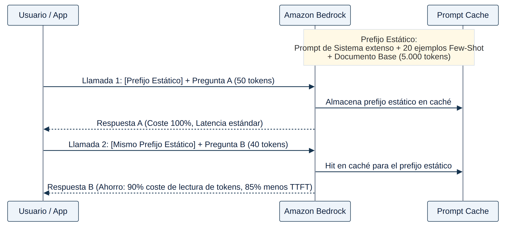

## MÓDULO 6: RENDIMIENTO, ESCALABILIDAD Y OPTIMIZACIÓN DE COSTES

En una aplicación de IA Generativa, el "rendimiento" no es una única variable: es la combinación de la latencia percibida por el usuario (cuánto tarda en aparecer el primer carácter de la respuesta), el throughput sostenido que la arquitectura puede absorber sin degradarse, y el coste por unidad de trabajo (por token, por invocación, por hora de capacidad reservada). Este módulo profundiza en las tres palancas que Amazon Bedrock ofrece para mover esas variables — streaming, prompt caching y los distintos modos de inferencia — y en cómo diseñar una aplicación resiliente frente al throttling, que es la forma en que Bedrock comunica que se ha superado una cuota de servicio.

### 6.1 Latencia percibida: streaming de respuestas

Cuando un modelo fundacional genera una respuesta larga, el tiempo total de generación puede oscilar entre varios segundos y más de un minuto. Si la aplicación espera a tener el texto completo antes de mostrar nada, el usuario percibe ese tiempo total como "lentitud" o incluso como un fallo (timeout). La técnica que resuelve esto no es acelerar al modelo, sino cambiar el contrato de entrega: en lugar de una única respuesta al final, el servicio entrega la respuesta en fragmentos (*chunks*) a medida que el modelo los genera. La métrica que de verdad le importa al usuario deja de ser la latencia total y pasa a ser el **Time To First Token (TTFT)**: el tiempo hasta que aparece el primer fragmento visible.

Amazon Bedrock expone esta capacidad a través de las variantes de streaming de sus dos familias de API: `ConverseStream` (recomendada, formato unificado entre proveedores) e `InvokeModelWithResponseStream` (payload específico del proveedor). Para flujos RAG existe además `RetrieveAndGenerateStream`, que combina recuperación y generación incremental en una sola llamada — una API distinta de `InvokeModelWithResponseStream`, que solo invoca el modelo y no ejecuta ninguna lógica de recuperación contra una Knowledge Base. Confundir ambas es un error de diseño frecuente: sustituir `RetrieveAndGenerate`/`RetrieveAndGenerateStream` por `InvokeModelWithResponseStream` obliga a reimplementar manualmente toda la orquestación de recuperación que Bedrock ya gestiona.

Recibir los fragmentos en el backend es solo la mitad del problema; la otra mitad es transportarlos hasta el navegador o la app del cliente sin perder el efecto incremental. Existen tres patrones de referencia:

- **AWS AppSync (GraphQL Subscriptions sobre WebSocket) + AWS Amplify AI Kit.** Amplify AI Kit (parte de Amplify Gen 2, paquete `@aws-amplify/ui-react-ai`) está diseñado específicamente para aplicaciones React que consumen Bedrock a través de AppSync: sus "conversation routes" usan las suscripciones GraphQL en tiempo real para entregar la respuesta token a token al cliente, mientras el resolver Lambda invocado en modo síncrono (`RequestResponse`, el valor por defecto de los resolvers Lambda de AppSync) sigue ejecutando la llamada a Bedrock en segundo plano. Es la opción de menor esfuerzo cuando la aplicación ya vive sobre la pila AppSync/Amplify, porque no exige rediseñar la arquitectura.
- **Amazon API Gateway WebSocket API + AWS Lambda.** Mantiene una conexión persistente y bidireccional entre cliente y backend; la función Lambda invoca `InvokeModelWithResponseStream` (o `ConverseStream`) y reenvía cada fragmento a la conexión activa mediante la API de administración de conexiones de API Gateway. Este patrón soporta miles de conexiones concurrentes con baja sobrecarga y es el recomendado por AWS para chat conversacional en tiempo real cuando no existe ya una capa AppSync.
- **AWS Lambda Function URLs con Response Streaming, o Server-Sent Events (SSE).** Alternativas más ligeras cuando no se necesita bidireccionalidad completa.

Hay un matiz de API Gateway que el examen evalúa con frecuencia y que conviene fijar con precisión: el "response transfer mode" `STREAM` para integraciones proxy (incluida una integración Lambda que usa *response streaming*) **solo está soportado en REST API, no en HTTP API**. Es un error común diseñar una arquitectura de streaming de bajo coste sobre una HTTP API (más barata y simple que una REST API) asumiendo que el streaming funcionará igual; si el requisito es transmitir la respuesta en tiempo real a través de una integración proxy de Lambda, la REST API es la única variante de API Gateway que lo admite hoy. Client-side polling contra una API de solicitud-respuesta única (por ejemplo, sondear cada 100 ms) no es streaming real: multiplica el número de solicitudes sin resolver el problema de fondo, porque no hay fragmentos parciales que consultar hasta que el modelo termina.

Por último, cuando la latencia del propio modelo (no la del transporte) es el cuello de botella, Bedrock ofrece **Latency Optimized Inference**: activarla mediante `performanceConfig: { "latency": "optimized" }` en la solicitud reduce el tiempo de respuesta para los modelos que la soportan sin necesidad de aprovisionar capacidad ni reentrenar el modelo. Se factura por uso, y si se agota la cuota de esta ruta optimizada, la solicitud simplemente cae a la inferencia estándar en lugar de fallar.

<figure class="diagram">

<figcaption>Mecánica de Prompt Caching en Amazon Bedrock</figcaption>
</figure>

Caso de Estudio

Una aplicación de asistencia al cliente en tiempo real necesita mostrar sugerencias mientras el cliente todavía está hablando, con menos de 1 segundo de latencia extremo a extremo, usando únicamente servicios gestionados. La arquitectura ganadora combina tres piezas de streaming encadenadas: Amazon Transcribe en modo streaming con *partial results* habilitados (entrega fragmentos de transcripción antes de que el hablante termine la frase), reenvío inmediato de esos fragmentos a Bedrock mediante `InvokeModelWithResponseStream` (para que el modelo también genere de forma incremental), y entrega al agente humano a través de una API WebSocket de API Gateway. Los distractores fallan por razones muy distintas entre sí: usar transcripción por lotes (batch) rompe la cadena de baja latencia en el primer eslabón, sin importar cuánto se optimicen los eslabones siguientes; insertar un paso de análisis de sentimiento con Amazon Comprehend añade una parada no solicitada; y publicar resultados en Amazon SNS sustituye una conexión bidireccional de baja latencia por un mecanismo de notificación asíncrona de baja frecuencia, pensado para otro tipo de carga de trabajo. La lección general: en una cadena de streaming, la latencia final la determina el eslabón más lento o más "por lotes" de toda la cadena, no solo el paso de generación del LLM.

### 6.2 Prompt Caching en profundidad

Muchas aplicaciones repiten, invocación tras invocación, un bloque de contexto idéntico: una instrucción de sistema extensa, un conjunto de ejemplos *few-shot*, un documento base o un catálogo de productos. Sin caché, Bedrock tiene que volver a procesar (a tarifa completa) ese bloque en cada llamada, aunque no haya cambiado un solo carácter. **Prompt Caching** resuelve esto permitiendo marcar puntos de control (*cache checkpoints*) en el prompt: el contenido hasta ese punto se almacena en caché y, si una llamada posterior reutiliza exactamente ese mismo prefijo, Bedrock lo recupera de la caché en lugar de reprocesarlo.

Los detalles operativos importan para el examen: cada modelo define un mínimo de tokens por checkpoint (por ejemplo, Claude 3.7 Sonnet requiere al menos 1.024 tokens para poder crear un checkpoint), la caché tiene un TTL de aproximadamente cinco minutos que se renueva con cada acierto (*cache hit*), los tokens escritos en caché por primera vez pueden facturarse a una tarifa distinta de los tokens leídos desde caché, y los tokens no cacheados se cobran a la tarifa estándar de entrada. Existen además dos modalidades: **caché explícita** (el desarrollador marca checkpoints de forma deliberada) y **caché implícita**, en la que Bedrock puede reutilizar automáticamente prefijos repetidos sin necesidad de checkpoints manuales, según el modelo.

Sobre el ahorro exacto: es habitual encontrar en material de estudio la cifra "hasta 90% de ahorro en coste de tokens de entrada y hasta 85% de reducción de latencia". Estas cifras proceden de casos de referencia publicados por AWS y son razonables como techo orientativo para prefijos muy largos con una alta tasa de aciertos de caché, pero no son una garantía fija ni universal: el ahorro real depende del modelo, de qué proporción del prompt es realmente cacheable, y de la tasa de aciertos en producción. Para el examen, lo importante no es memorizar el porcentaje exacto, sino entender el mecanismo: prompt caching ataca directamente el **coste de tokens de entrada repetidos** y el **TTFT**, no mejora la velocidad de generación de tokens de salida ni sustituye a un mecanismo de reintentos o de escalado de capacidad.

Prompt caching es también, con frecuencia, la respuesta correcta frente a alternativas que "reinventan" con infraestructura propia algo que Bedrock ya resuelve de forma nativa: montar una capa de caché en Amazon ElastiCache o en Amazon DynamoDB para las mismas consultas repetidas exige desplegar, operar y pagar infraestructura adicional, mientras que prompt caching está integrado en la propia API de Bedrock sin componentes nuevos que gestionar.

Caso de Estudio

Un asistente de atención al cliente procesa habitualmente 50.000 consultas diarias, con picos de hasta 150.000 durante eventos promocionales, y un análisis muestra que el 40% de las consultas comparten el mismo contexto de base. La solución más rentable no es comprar Provisioned Throughput dimensionado para el pico (esa capacidad quedaría infrautilizada el resto del tiempo, ya que se factura de forma constante independientemente del uso real) ni montar una caché propia en ElastiCache o DynamoDB (duplica con infraestructura propia algo que Bedrock ya ofrece de forma nativa). La combinación ganadora es activar Latency Optimized Inference (sin coste fijo, sin aprovisionar nada, con caída elegante a inferencia estándar si se agota la cuota) junto con Prompt Caching para aprovechar exactamente ese 40% de contexto repetido. El patrón general: cuando un escenario menciona explícitamente que "una parte del tráfico comparte contexto" y pide la solución "más rentable", casi siempre se está apuntando a Prompt Caching frente a soluciones de capacidad fija o de caché externa.

### 6.3 Resiliencia ante Throttling: reintentos, modo adaptativo y circuit breaker

El error HTTP 429 (Throttling) aparece cuando una aplicación supera la cuota de solicitudes por minuto (RPM) o tokens por minuto (TPM) de una región. La reacción reflexiva de subir el timeout del cliente no ataca la causa raíz: el problema no es que la respuesta tarde, es que la solicitud ni siquiera se está aceptando.

Los SDK de AWS ofrecen varios modos de reintento, y distinguirlos es un punto muy examinado:

- **Modo `legacy`/fijo:** reintentos con un retraso fijo, sin distinguir el tipo de error. No se adapta a la disponibilidad cambiante del servicio y es la opción menos recomendable.
- **Modo `standard`:** el modo por defecto recomendado por AWS; ya incorpora **backoff exponencial con jitter aleatorizado** y aplica retrasos distintos según el tipo de error (retrasos más cortos para errores transitorios de red, más largos para errores de limitación de cuota). El *jitter* — un componente aleatorio añadido al tiempo de espera — existe específicamente para evitar el problema de *thundering herd*: si todos los clientes reintentan exactamente al mismo intervalo tras un fallo masivo, generan una nueva oleada sincronizada de solicitudes que puede volver a saturar el servicio.
- **Modo `adaptive`:** añade sobre el modo estándar un limitador de tasa del lado del cliente que ralentiza automáticamente el envío de solicitudes en cuanto detecta señales de throttling del servicio, sin esperar a que se agote el presupuesto de reintentos. La documentación de referencia de los SDK de AWS lo recomienda explícitamente para *"AI workloads that call a single API operation at high volume"* — exactamente el patrón de una aplicación que invoca repetidamente `InvokeModel` o `Converse` contra Bedrock durante picos de tráfico.

Por encima del nivel de reintento individual, el **AWS Well-Architected Framework (Agentic AI Lens)** recomienda complementar el backoff adaptativo con un patrón de **circuit breaker**: un mecanismo que, cuando la tasa de errores supera un umbral predefinido, desactiva temporalmente los reintentos durante una ventana de tiempo en lugar de seguir bombardeando un servicio ya saturado, y los reactiva gradualmente cuando el servicio se recupera. Es la diferencia entre "reintentar más inteligentemente" (adaptive) y "dejar de intentarlo durante un rato" (circuit breaker) cuando la situación es claramente insostenible.

Cuando el problema no es un pico puntual sino una cuota regional estructuralmente insuficiente, la resiliencia por reintentos deja de ser suficiente y hace falta más capacidad o más rutas: **desacoplamiento asíncrono** con una cola de Amazon SQS o un bus de Amazon EventBridge frente a los componentes consumidores, para amortiguar y aplanar picos de tráfico antes de que lleguen a Bedrock; **Cross-Region Inference Profiles**, que enrutan automáticamente el exceso de tráfico hacia otras regiones dentro del mismo perfil geográfico (`us.`, `eu.`, `apac.`) o de un perfil global, sin coste de enrutamiento adicional y facturado a tarifa on-demand estándar — la documentación de AWS lo recomienda explícitamente cuando "la disponibilidad y el throughput priman sobre el coste"; o **Provisioned Throughput**, cuando lo que se necesita es capacidad dedicada y predecible, no solo más rutas. Conviene fijar un matiz operativo poco intuitivo: los perfiles de inferencia entre regiones y el Provisioned Throughput son mecanismos distintos y, según la documentación de Bedrock, **no se combinan** en una misma solicitud — hay que elegir entre repartir tráfico on-demand entre regiones o reservar capacidad dedicada en una configuración concreta, no ambas cosas a la vez sobre el mismo perfil.

Un detalle operativo que el examen usa como trampa recurrente: reservar Provisioned Throughput no basta por sí solo. Para que una solicitud realmente utilice la capacidad reservada, hay que sustituir el `modelId` de la llamada (`InvokeModel`, `InvokeModelWithResponseStream`, `Converse` o `ConverseStream`) por el **ARN del modelo aprovisionado** que devuelve la API `CreateProvisionedModelThroughput` en el campo `provisionedModelArn`. Si el código sigue apuntando al identificador del modelo base (por ejemplo `anthropic.claude-v2`), todo el tráfico seguirá cayendo en la capacidad on-demand compartida — con el síntoma característico de que las métricas de CloudWatch muestran la capacidad aprovisionada sin uso mientras las solicitudes on-demand siguen sufriendo throttling, aunque la empresa ya esté pagando por la capacidad dedicada.

Para diagnosticar throttling con precisión, el espacio de nombres `AWS/Bedrock` de CloudWatch expone métricas específicas: `Invocations`, `InputTokenCount`, `OutputTokenCount` y, de forma crítica, `InvocationThrottles` — que cuenta específicamente las invocaciones limitadas por el sistema y que **no** se contabiliza dentro de `Invocations` ni se confunde con errores de cliente o de servidor (`InvocationClientErrors`/`InvocationServerErrors`, que miden otra cosa: fallos de la solicitud o del servicio, no limitación de cuota).

Caso de Estudio

Una aplicación educativa sobre AWS Lambda sufre throttling recurrente durante las horas punta de cada zona horaria (el tráfico se concentra por las tardes/noches locales de usuarios repartidos por el mundo), y el requisito explícito es no incurrir en un coste fijo por hora durante los periodos de baja demanda. Comprar Provisioned Throughput dimensionado para el pico global queda descartado de raíz por ese único requisito de coste, sin importar cuánto resuelva el throttling técnicamente. La solución consiste en habilitar el registro de invocaciones de Bedrock, vigilar específicamente la métrica `InvocationThrottles` (no las métricas genéricas de latencia o errores, que no distinguen throttling de otros fallos) y repartir el tráfico mediante Cross-Region Inference, que sigue facturándose a tarifa on-demand y por tanto no añade ningún coste fijo durante las horas de baja demanda de cada franja horaria. El patrón de examen: cuando un enunciado combina "picos de tráfico impredecibles o distribuidos en el tiempo" con "sin coste fijo durante baja demanda", casi siempre descarta Provisioned Throughput y apunta a Cross-Region Inference (o, si el pico es de contenido repetido, a Prompt Caching).

### 6.4 Coste: eligiendo el modo de inferencia correcto

Los cuatro modos de inferencia de Bedrock (On-Demand, Provisioned Throughput, Batch Inference y Cross-Region Inference — desarrollados en profundidad en el Módulo 1) tienen perfiles de coste radicalmente distintos, y una parte importante del examen consiste en identificar cuál combina mejor con el patrón de tráfico descrito en el escenario:

- **On-Demand** es la opción por defecto para tráfico interactivo variable: se paga estrictamente por token, sin compromiso, pero está sujeto a las cuotas de TPS/TPM compartidas de la región.
- **Provisioned Throughput** convierte el coste en un cargo fijo predecible (por hora, o con descuento si se compromete a 1 o 6 meses) a cambio de capacidad garantizada; es rentable solo cuando el volumen sostenido justifica pagar por capacidad incluso en los valles de tráfico, y es la única vía para servir modelos personalizados (fine-tuned).
- **Batch Inference** ofrece el coste por token más bajo (con un descuento significativo frente a on-demand, según la página de precios de Bedrock) a cambio de renunciar a la interactividad: los trabajos se procesan de forma asíncrona leyendo y escribiendo en Amazon S3, no soportan *tool calling* ni salida estructurada multi-turno, y no son compatibles con modelos que ya tienen Provisioned Throughput asociado.
- **Cross-Region Inference** no cambia el precio por token (sigue siendo tarifa on-demand) pero cambia la disponibilidad: es la palanca correcta cuando el objetivo es throughput y continuidad de servicio, no ahorro de coste directo.

Confundir estos ejes — tratar Cross-Region como una palanca de ahorro, o Provisioned Throughput como una palanca de latencia por sí sola sin acompañarla de streaming o de Latency Optimized Inference — es la fuente más común de distractores plausibles en este bloque del examen.

### Fuentes

- https://docs.aws.amazon.com/bedrock/latest/userguide/prompt-caching.html
- https://docs.aws.amazon.com/wellarchitected/latest/generative-ai-lens/gencost03-bp03.html
- https://docs.aws.amazon.com/bedrock/latest/userguide/latency-optimized-inference.html
- https://docs.aws.amazon.com/bedrock/latest/userguide/prov-throughput.html
- https://docs.aws.amazon.com/bedrock/latest/userguide/prov-thru-use.html
- https://docs.aws.amazon.com/bedrock/latest/APIReference/API_CreateProvisionedModelThroughput.html
- https://docs.aws.amazon.com/bedrock/latest/userguide/cross-region-inference.html
- https://docs.aws.amazon.com/bedrock/latest/userguide/geographic-cross-region-inference.html
- https://docs.aws.amazon.com/bedrock/latest/userguide/capacity-limits-cost-optimization.html
- https://docs.aws.amazon.com/bedrock/latest/userguide/monitoring-runtime-metrics.html
- https://docs.aws.amazon.com/bedrock/latest/userguide/batch-inference.html
- https://docs.aws.amazon.com/bedrock/latest/APIReference/API_agent-runtime_RetrieveAndGenerateStream.html
- https://docs.aws.amazon.com/apigateway/latest/developerguide/response-transfer-mode.html
- https://docs.aws.amazon.com/apigateway/latest/developerguide/http-api-vs-rest.html
- https://docs.aws.amazon.com/apigateway/latest/developerguide/apigateway-websocket-api.html
- https://docs.aws.amazon.com/transcribe/latest/dg/streaming-partial-results.html
- https://docs.aws.amazon.com/sdkref/latest/guide/feature-retry-behavior.html
- https://docs.aws.amazon.com/wellarchitected/latest/agentic-ai-lens/agentperf06-bp02.html
- https://docs.aws.amazon.com/prescriptive-guidance/latest/cloud-design-patterns/circuit-breaker.html
