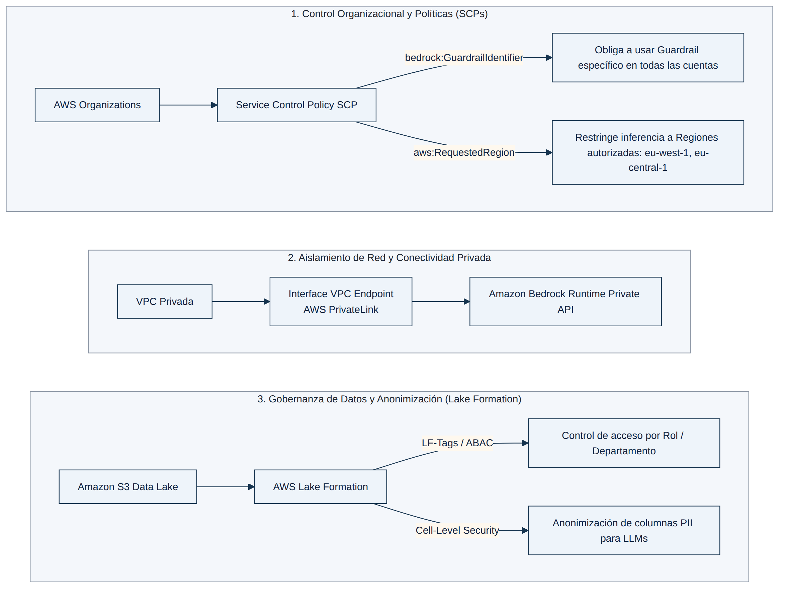

## MÓDULO 7: SEGURIDAD, GOBERNANZA, PRIVACIDAD Y CUMPLIMIENTO

Ninguna aplicación de IA Generativa llega a producción en una empresa real sin resolver antes cuatro preguntas: ¿quién puede invocar qué modelo?, ¿por dónde viaja el tráfico?, ¿quién puede ver qué dato? y ¿quién hizo qué y cuándo? Este módulo es, con 16 de las 97 preguntas del banco de práctica, el bloque temático más examinado después de Agentes y RAG — y no por casualidad: la inmensa mayoría de los escenarios de seguridad en el examen no piden "la solución más segura en abstracto", sino la combinación exacta de servicios nativos de AWS que resuelve varios requisitos simultáneos (control de acceso, residencia de datos, auditoría, gobernanza de prompts) con el mínimo desarrollo a medida. Entender el propósito exacto de cada servicio — y, sobre todo, los límites de cada uno — es lo que separa la respuesta correcta de los distractores plausibles.

### 7.1 Control centralizado con Organizations y Service Control Policies

Cuando una organización usa AWS Organizations con todas las funciones habilitadas, puede aplicar **Service Control Policies (SCP)** que actúan como un techo de permisos sobre todas las cuentas miembro, independientemente de lo que digan las políticas de IAM locales. Para Amazon Bedrock, dos claves de condición son las que el examen espera que domines:

- **`bedrock:GuardrailIdentifier`**: permite denegar cualquier llamada a `InvokeModel`, `InvokeModelWithResponseStream`, `Converse` o `ConverseStream` que no incluya el identificador (y opcionalmente la versión) de un guardrail concreto. Es el mecanismo estándar para forzar que **todas** las invocaciones de Bedrock en la organización pasen por un guardrail corporativo, sin depender de que cada equipo lo configure voluntariamente en su código.
- **`bedrock:modelId`** (o restringir el recurso `foundation-model/*` a una lista de ARN): limita qué modelos concretos puede invocar un principal, de modo que solo los modelos "aprobados" por el equipo de gobernanza estén disponibles.

Una SCP bien diseñada combina ambas condiciones en una sola política `Deny` con un `Condition` de tipo `StringNotEquals`, de forma que cualquier llamada que no traiga el guardrail aprobado o que apunte a un modelo no autorizado se bloquea a nivel de organización, antes incluso de llegar a evaluarse la política de IAM del rol. Es importante no confundir esto con un **IAM permissions boundary**: el boundary limita el techo de permisos de un *rol* individual, pero no es el mecanismo que AWS documenta para exigir un guardrail en tiempo de invocación: añadir un boundary junto a una SCP que ya cubre ambos requisitos es una capa redundante, no una mejora de seguridad.

Las SCP también se usan para **restringir regiones** mediante `aws:RequestedRegion`, un patrón habitual cuando una empresa europea solo puede operar en `eu-central-1` y `eu-west-1` por motivos de residencia de datos. Aquí aparece uno de los matices más finos del examen: si la empresa además quiere usar **Cross-Region Inference (CRI)** — necesario, por ejemplo, para acceder a un modelo como Amazon Nova Pro que solo soporta invocación mediante *inference profile* — la SCP debe ampliarse explícitamente para permitir el **perfil de inferencia geográfico** (p. ej. `eu.amazon.nova-pro-v1:0`), y los roles de IAM deben tener permiso de invocación no solo sobre ese perfil, sino sobre el ARN del modelo subyacente en **todas** las regiones de destino que ese perfil pueda usar como *fallback* dentro de la geografía — no solo en la región "principal". Un error típico de SCP demasiado restrictiva (bloquear todo excepto `eu-central-1`) provoca exactamente el error real `"a service control policy explicitly denies the action"` cuando el perfil intenta enrutar a `eu-west-3`. La solución nunca es abrir un prefijo genérico como `eu.*` (demasiado amplio, viola el principio de mínimo privilegio) ni otorgar `AdministratorAccess` (elimina todo control); es autorizar **el perfil concreto** y sus regiones de destino conocidas.

### 7.2 Aislamiento de red con AWS PrivateLink

Cuando el requisito es que el tráfico entre la aplicación y Amazon Bedrock **nunca salga a Internet pública**, la respuesta es un **Interface VPC Endpoint** (basado en AWS PrivateLink) hacia los endpoints de servicio de Bedrock — típicamente `bedrock` (plano de control) y `bedrock-runtime` (invocación de modelos), y de forma análoga `bedrock-agent-runtime` cuando se usan Agents o Knowledge Bases. Con el endpoint desplegado en las subredes privadas de la VPC, las funciones Lambda o instancias que invocan Bedrock no necesitan IP pública, gateway de Internet, NAT ni VPN/Direct Connect.

Un distractor recurrente en el examen es proponer un **NAT Gateway** como solución de conectividad: un NAT Gateway traduce direcciones para tráfico **saliente hacia Internet**, por lo que usarlo para llegar a Bedrock significa que el tráfico sí sale a la red pública — justo lo contrario del requisito. Otro matiz importante: un **Gateway Endpoint** (el tipo usado para S3 y DynamoDB) no es lo mismo que un **Interface Endpoint** (el tipo que usa Bedrock); confundir ambos tipos de endpoint es un error común en las opciones incorrectas.

El aislamiento de red por sí solo no controla *quién* puede invocar el modelo dentro de esa VPC — para eso se combina con condiciones de IAM (por ejemplo, restringiendo por `aws:sourceVpce`) y, cuando se necesita control de acceso por atributo de usuario o departamento, con **IAM ABAC (Attribute-Based Access Control)**: roles con etiquetas de sesión o de principal (p. ej. `department=finance`) evaluadas en políticas que conceden permisos distintos según el atributo, en lugar de mantener un rol de IAM separado por cada departamento.

### 7.3 Gobernanza de datos: AWS Lake Formation frente a S3 y Glue

Cuando el escenario habla de **control de acceso a nivel de columna** sobre un data lake (por ejemplo, para que un modelo de detección de fraude solo vea columnas financieras con las columnas de PII redactadas), la respuesta correcta es casi siempre **AWS Lake Formation con LF-Tags (Lake Formation Tag-Based Access Control, LF-TBAC)**. El patrón es: se definen etiquetas clave-valor (`unidad_negocio=finanzas`, `region=eu-west-1`) y se asignan a bases de datos, tablas y, de forma crítica, a **columnas concretas** del Glue Data Catalog; después se conceden permisos sobre **expresiones de LF-Tags** en lugar de sobre cada combinación individual de principal y recurso. Esto es lo que hace que LF-TBAC **escale**: con *grants* directos (named resource method) el número de concesiones crece combinatoriamente con el número de unidades de negocio y regiones, mientras que con LF-Tags basta con añadir la etiqueta correspondiente a los nuevos recursos.

El error de diseño más repetido en los distractores es aplicar el control de gobernanza **directamente sobre objetos de S3** (bucket policies, ACL, o incluso *object tags* de S3) en lugar de sobre el catálogo de metadatos centralizado. Las etiquetas de S3 son propiedades de un objeto individual: no se integran con el modelo de permisos de Lake Formation ni con herramientas analíticas como Athena, EMR o Redshift, y **no ofrecen ningún mecanismo de filtrado o redactado a nivel de columna** — solo Lake Formation lo hace de forma nativa. Dicho esto, S3 sí tiene un rol legítimo en gobernanza cuando el requisito es más simple: los **metadatos de sistema** de S3 (fecha de creación del objeto) sirven de forma nativa para *timestamps* de documento; los **object tags** (hasta 10 por objeto) son la herramienta correcta para clasificar por categoría o dominio; y los **metadatos definidos por el usuario** (`x-amz-meta-*`) permiten adjuntar atributos arbitrarios como el autor — sin necesidad de abrir el contenido del documento, algo valioso para que un FM entienda el contexto de un documento antes de procesarlo. La clave de examen es distinguir cuándo el requisito es "atribuir/etiquetar objetos individuales" (S3 nativo) de cuándo es "gobernar el acceso columna por columna a través de múltiples cuentas y servicios analíticos" (Lake Formation).

Para el registro y catalogación de fuentes de datos no estructuradas (transcripciones, informes, documentación) con calidad de datos verificable, el servicio correcto es **AWS Glue**: un *crawler* de Glue cataloga automáticamente el esquema en el **Glue Data Catalog** (generando metadatos auditables sin esfuerzo manual), los *ETL jobs* ejecutan la lógica de *chunking* o transformación personalizada, y **AWS Glue Data Quality** — basado en el framework open-source Deequ y su lenguaje declarativo DQDL — aplica más de 25 reglas de calidad predefinidas, detecta anomalías con ML y aísla registros problemáticos, todo en una única canalización sin servidores. Frente a esto, herramientas como Amazon SageMaker Data Wrangler (pensada para *feature engineering* tabular de ML) o Amazon Comprehend (extracción de entidades, sin reglas de calidad declarativas) exigen construir manualmente las piezas que Glue ya ofrece de forma nativa.

Caso de Estudio — LF-Tags vs. grants directos

Una aseguradora con datos financieros sensibles en su data lake necesita que un modelo de detección de fraude en Amazon Bedrock consuma solo las columnas autorizadas, con el PII de esas tablas redactado, y un registro de auditoría de cada acceso. La tentación es usar concesiones directas de Lake Formation sobre tablas concretas (*named resource method*) y añadir una capa de aplicación a medida que filtre columnas y registre accesos. Esa solución no escala: cada nueva combinación de unidad de negocio y región exige una concesión adicional, y la capa de filtrado personalizada duplica una capacidad que Lake Formation ya ofrece de forma nativa. La solución correcta es autenticar mediante roles de IAM y conceder permisos LF-TBAC sobre expresiones de LF-Tags asignadas a bases de datos, tablas y columnas, con el filtrado de columnas sensibles resuelto de forma nativa por Lake Formation y el registro de auditoría cubierto automáticamente por AWS CloudTrail (incluyendo llamadas como `GetDataAccess`).

### 7.4 Validación preventiva de infraestructura: AWS CloudFormation Guard

Cuando el enunciado pide "validar plantillas de CloudFormation/CDK **antes** de que los recursos se aprovisionen" o habla de "policy-as-code" en un pipeline de CI/CD, la respuesta es **AWS CloudFormation Guard (`cfn-guard`)**. Es una herramienta de línea de comandos declarativa (con su propio DSL de reglas) que evalúa una plantilla contra un conjunto de políticas — por ejemplo, "todo bucket S3 debe tener cifrado KMS" o "ningún endpoint puede ser público" — y falla el pipeline **antes del despliegue** si detecta una violación, dando retroalimentación temprana al desarrollador.

El matiz que el examen explota repetidamente es la diferencia entre **prevención y detección**: si una opción describe ejecutar `cfn-guard` **después** de que los recursos ya se desplegaron, esa opción es incorrecta — el valor de `cfn-guard` está en el *gate* de CI/CD, no en una auditoría posterior, porque para entonces el recurso no conforme ya existe. Ese rol reactivo (evaluar el cumplimiento de configuración de recursos ya desplegados) es el que corresponde a **AWS Config**, no a `cfn-guard`. Del mismo modo, **Amazon Macie** (clasificación de datos sensibles en S3) y **AWS Service Catalog** (portfolios de productos versionados, pero con despliegue manual desde consola) resuelven problemas de gobernanza distintos: ninguno sustituye a un *gate* automatizado de políticas como código integrado en el pipeline. El patrón de referencia que documenta el AWS Well-Architected Generative AI Lens para múltiples unidades de negocio es: plantillas de CloudFormation estandarizadas y versionadas en un repositorio central + pipeline de CI/CD que integra `cfn-guard` como paso de validación previo al despliegue.

### 7.5 Gobernanza de Amazon Q Business y Amazon Q Developer

Dos patrones de Amazon Q aparecen de forma recurrente y con una redacción muy parecida a propósito, para poner a prueba si conoces el mecanismo exacto:

- **Control de acceso en el conector S3 de Amazon Q Business**: se configura mediante un **único archivo JSON** (comúnmente `acl.json`, referenciado por el parámetro `aclConfigurationFilePath`) colocado en el bucket, que contiene un array de entradas: cada elemento define un `keyPrefix` (el prefijo S3 de un departamento) junto con una lista de `aclEntries` (`Name`, `Type`: `USER`/`GROUP`, `Access`: `ALLOW`/`DENY`). **No** se crean archivos `acl.json` independientes por carpeta de departamento — eso multiplica el mantenimiento sin beneficio. Detalle importante para producción: cualquier prefijo que **no** aparezca en el archivo queda accesible para **todos** los usuarios, así que el archivo debe ser exhaustivo.
- **Amazon Q Business Data Accessor**: el patrón correcto cuando un ISV (proveedor de software) necesita enriquecer prompts con datos empresariales de **múltiples clientes externos**, sin desplegar infraestructura en el entorno de cada cliente. Cada cliente configura su propio índice de Q Business sobre sus datos internos y designa al ISV como *data accessor* verificado; el ISV consulta después la API `SearchRelevantContent`, que respeta los controles de acceso del cliente (solo devuelve lo que el usuario final podría ver). Esto es preferible a que cada cliente construya su propia Knowledge Base de Bedrock con consultas cross-account, o a desplegar servidores MCP en tiempo real en cada entorno cliente: ambas alternativas multiplican la infraestructura a mantener por cliente, algo explícitamente descartado cuando el requisito es "mínima complejidad arquitectónica" a escala de millones de clientes.
- **Amazon Q Developer Customizations** frente a **`.amazonq/rules`**: las *customizations* son personalizaciones a nivel de cuenta/organización, configuradas una sola vez por un administrador (conectando repositorios internos vía S3 o AWS CodeConnections) para que las sugerencias *in-line* de código respeten las bibliotecas, algoritmos y estilos propios de la empresa, sin tocar la configuración de cada proyecto. La carpeta `.amazonq/rules` en la raíz de un proyecto, en cambio, almacena *reglas de proyecto* en Markdown que Amazon Q usa como contexto de chat **para ese proyecto concreto** — útil, pero es exactamente el tipo de configuración "a nivel de proyecto" que una customization centralizada evita cuando el requisito explícito es no modificar cada proyecto individualmente.

### 7.6 Gestión del ciclo de vida de prompts: Amazon Bedrock Prompt Management

Cuando el requisito de gobernanza se refiere a **plantillas de prompts** (no a datos ni a infraestructura), el servicio nativo es **Amazon Bedrock Prompt Management**: permite crear prompts reutilizables, parametrizarlos con variables (`{{variable}}`), y crear **versiones inmutables** de cada prompt con capacidad de comparar versiones y desplegar una concreta en producción. El control de **quién puede crear o publicar** una versión se resuelve con políticas de IAM basadas en identidad sobre las operaciones de la API (`CreatePrompt`, `CreatePromptVersion`, `UpdatePrompt`), y el rastro de auditoría lo proporciona **AWS CloudTrail**, que registra automáticamente esas llamadas como eventos de gestión. Vale la pena memorizar un matiz honesto: Prompt Management **no** incluye una funcionalidad nativa de notificaciones push de "revisión pendiente" — ese aspecto se aproxima mediante permisos de IAM (solo un rol "aprobador" puede publicar una versión), no mediante una alerta automática del servicio. Reconstruir todo esto desde cero con Step Functions, S3 y EventBridge sí cubriría las notificaciones de forma más directa, pero renuncia al versionado inmutable y a la integración nativa con el resto de Bedrock que ya ofrece Prompt Management sin desarrollo adicional.

### 7.7 Auditoría, cifrado y visibilidad operativa

El requisito "quién accedió a qué y cuándo" combina siempre tres piezas: **control de acceso** (IAM/ABAC + condiciones de guardrail/modelo), **cifrado** (SSE-KMS en S3 y en los buckets de logging) y **registro de eventos**. Aquí el detalle que distingue la respuesta correcta de un distractor plausible es la **granularidad** del registro:

- **AWS CloudTrail** con **eventos de gestión y de datos** habilitados sobre objetos de S3 y sobre el uso de claves de KMS, enviado opcionalmente a **AWS CloudTrail Lake** para consultas SQL retenidas, es el mecanismo que documenta de forma completa quién invocó qué API, cuándo y desde dónde.
- **Amazon CloudWatch Logs** registra métricas y logs de aplicación, pero no sustituye a CloudTrail como registro de auditoría de llamadas a la API con identidad del llamador.
- Los **trace events de Bedrock Agents** (ver Módulo 5) auditan el razonamiento interno de un agente, pero no el acceso a nivel de archivo a un almacén de datos como S3.
- El **S3 server access logging** añade el detalle de interacción a nivel de archivo individual que CloudTrail por sí solo, en su configuración básica, puede no capturar con el mismo nivel de detalle por objeto.
- **AWS CloudTrail Insights** detecta patrones anómalos de volumen de llamadas, útil para alertar, pero no es un registro exhaustivo de cada acceso individual — hace falta combinarlo con los eventos estándar de gestión y de datos.

Un escenario típico exige combinar varias de estas piezas: VPC endpoints para I/O seguro del modelo, ABAC + `bedrock:GuardrailIdentifier`/`modelId` para controlar quién invoca qué, CloudTrail (gestión + datos) y S3 server access logging para la auditoría fina, y SSE-KMS para el cifrado en reposo. Una opción que solo cubre la parte de red y guardrails, pero omite el control de acceso granular o el registro a nivel de archivo, resuelve la seguridad de la conexión pero no la trazabilidad completa que exige el enunciado.

Caso de Estudio — Residencia de datos y Cross-Region Inference geográfico

Una empresa europea, con SCPs que restringen sus cuentas a `eu-north-1` y `eu-west-1`, selecciona un modelo alojado en `eu-central-1` y `eu-west-3`, y necesita que las peticiones de sus empleados lleguen a ese modelo de forma privada y sin salir de Europa. Desplegar el modelo en EC2 o en SageMaker no tiene sentido: Bedrock es un servicio gestionado que no distribuye pesos de modelo para autoalojamiento, y renunciar a Bedrock tras haberlo evaluado duplicaría trabajo. La solución correcta combina tres piezas: un **inference profile geográfico** (`eu.*`) para que Bedrock enrute automáticamente entre regiones europeas sin cruzar el continente; un **VPC endpoint de interfaz** para que el tráfico entre la VPC corporativa y Bedrock no toque Internet pública; y una **ampliación explícita de las SCP** para autorizar las regiones de destino reales del perfil (`eu-central-1`, `eu-west-3`), además de las ya permitidas. Omitir la ampliación de la SCP es el error más común: el perfil de inferencia no puede saltarse una denegación explícita a nivel de organización.

Caso de Estudio — Bloquear un tema, no solo enmascararlo

Una organización con SCPs a nivel de AWS Organizations quiere impedir que información propietaria y ciertos temas lleguen a los prompts de Bedrock, y que los empleados solo usen modelos aprobados. La combinación ganadora es una SCP que restringe los modelos permitidos y exige un `bedrock:GuardrailIdentifier` aprobado en cada llamada, más un guardrail desplegado de forma consistente en todas las cuentas mediante **CloudFormation StackSets**, configurado con una **política de bloqueo (block)** sobre los temas denegados. El matiz que separa esto de un distractor: una política de **enmascarado (mask)** en los filtros de información sensible sustituye el dato por una etiqueta pero deja que la solicitud siga procesándose — sirve para PII que debe seguir fluyendo de forma anonimizada, no para **impedir** que un tema o un dato propietario llegue al modelo. Cuando el verbo del enunciado es "prevenir" o "bloquear", la política debe ser `block`, no `mask`.

<figure class="diagram">

<figcaption>Capas de seguridad y gobernanza para cargas de trabajo GenAI en AWS: control organizativo (SCP), aislamiento de red (PrivateLink), gobernanza de datos (Lake Formation) y validación preventiva de IaC (cfn-guard).</figcaption>
</figure>

### Fuentes

- https://docs.aws.amazon.com/bedrock/latest/userguide/vpc-interface-endpoints.html
- https://docs.aws.amazon.com/bedrock/latest/userguide/guardrails-permissions-id.html
- https://docs.aws.amazon.com/bedrock/latest/userguide/geographic-cross-region-inference.html
- https://docs.aws.amazon.com/bedrock/latest/userguide/cross-region-inference.html
- https://docs.aws.amazon.com/bedrock/latest/userguide/inference-profiles-support.html
- https://docs.aws.amazon.com/bedrock/latest/userguide/guardrails-sensitive-filters.html
- https://docs.aws.amazon.com/bedrock/latest/userguide/prompt-management.html
- https://docs.aws.amazon.com/bedrock/latest/userguide/logging-using-cloudtrail.html
- https://docs.aws.amazon.com/bedrock/latest/userguide/kb-managed-cross-account.html
- https://docs.aws.amazon.com/lake-formation/latest/dg/tag-based-access-control.html
- https://docs.aws.amazon.com/lake-formation/latest/dg/cross-account-TBAC.html
- https://docs.aws.amazon.com/lake-formation/latest/dg/logging-using-cloudtrail.html
- https://docs.aws.amazon.com/AWSCloudFormation/latest/UserGuide/best-practices.html
- https://docs.aws.amazon.com/cfn-guard/latest/ug/what-is-guard.html
- https://docs.aws.amazon.com/wellarchitected/latest/generative-ai-lens/generative-ai-lens.html
- https://docs.aws.amazon.com/amazonq/latest/qbusiness-ug/s3-user-management.html
- https://docs.aws.amazon.com/amazonq/latest/qbusiness-ug/isv.html
- https://docs.aws.amazon.com/amazonq/latest/qdeveloper-ug/context-project-rules.html
- https://docs.aws.amazon.com/prescriptive-guidance/latest/best-practices-code-generation/advanced-capabilities.html
- https://docs.aws.amazon.com/glue/latest/dg/glue-data-quality.html
- https://docs.aws.amazon.com/AmazonS3/latest/userguide/UsingMetadata.html
- https://docs.aws.amazon.com/AmazonS3/latest/userguide/object-tagging.html
- https://docs.aws.amazon.com/macie/latest/user/what-is-macie.html
